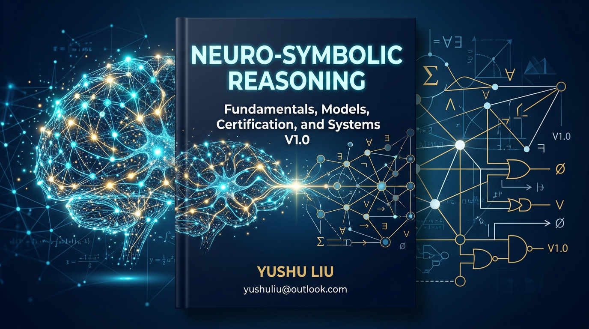
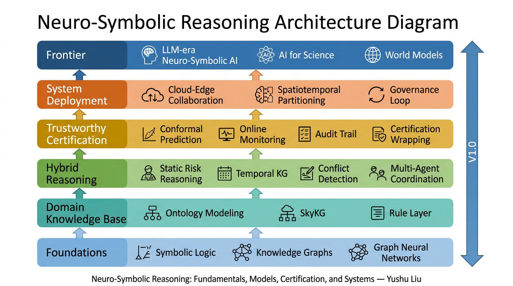

<h1 align="center">Neuro-Symbolic Reasoning:<br>Fundamentals, Models, Certification, and Systems</h1>

<p align="center">
  <strong>V1.0 — Open English Manuscript</strong><br>
  A Knowledge-Graph-Driven Framework for Trustworthy Governance<br>in Urban Air Mobility and Safety-Critical AI
</p>

<p align="center">
  <a href="LICENSE"></a>
  <a href="LICENSE"></a>
  <a href="CITATION.cff"></a>
  <a href="CONTRIBUTING.md"></a>
</p>

<p align="center">
  <b>Yushu Liu</b> &nbsp;|&nbsp;
  <a href="mailto:yushuliu@outlook.com">yushuliu@outlook.com</a> &nbsp;|&nbsp;
  <a href="https://github.com/liuyushugreat">GitHub</a>
</p>

---

## What Is This Book About?

Modern AI excels at perception and generation but still struggles with **explicit reasoning, rule compliance, uncertainty calibration, and certifiable deployment** in safety-critical settings.

This book develops a **complete technical stack** for neuro-symbolic AI — not just one model trick, but a full pipeline:

> **Knowledge Base → Hybrid Reasoning → Trustworthy Certification → System Deployment → Governance Loop**

It covers 25 chapters across six layers, from symbolic logic and knowledge graphs all the way to cloud-edge deployment and LLM-era agents. **Urban air mobility (UAM)** is the primary scenario, but the methodology applies to autonomous driving, medical AI, industrial control, and AI for Science.

<p align="center">
  
</p>

## How Is This Book Different?

| Dimension | Typical NeSy / Trustworthy AI resources | This book |
|-----------|----------------------------------------|-----------|
| **Scope** | Single technique (e.g., logic + NN) | Full stack: knowledge → reasoning → certification → deployment |
| **Trustworthiness** | Interpretability-focused | Goes beyond to **conformal prediction, online monitoring, certification wrapping, audit trails** |
| **System view** | Model-centric | Addresses **compute gaps, cloud-edge collaboration, spatiotemporal partitioning, governance loops** |
| **Application** | Abstract benchmarks | Grounded in a **real safety-critical domain** (UAM) with generalizable patterns |
| **Openness** | Closed textbook or scattered papers | **Full open manuscript** with runnable labs, knowledge graph, and structured reading paths |

**In one sentence:** This book is the first open resource that traces the entire path from symbolic logic to certifiable, deployable neuro-symbolic systems, with a real safety-critical domain as its testbed.

## About the Author

**Yushu Liu (刘玉书)** is a researcher in artificial intelligence, decision intelligence, and digital governance. He is currently pursuing a Ph.D. in Electronic Information Engineering (Large Models) at **Tianjin University** and serves as Deputy Secretary-General of the Zhongguancun Software and Information Service Industry Innovation Alliance.

**Research directions:**

- Neuro-symbolic AI and hybrid reasoning
- Trustworthy, certifiable, and governable AI
- Knowledge-graph-driven decision intelligence
- Low-altitude traffic governance and safety-critical systems
- Deployable AI under real-world constraints

**Contact:** [yushuliu@outlook.com](mailto:yushuliu@outlook.com)

---

## Table of Contents (25 Chapters + 3 Appendices)

### Part I — Foundations (Ch. 1–4)

| # | Chapter | Key topics |
|---|---------|------------|
| 1 | [The Evolution, Fracture, and Reconstruction of AI](chapters/Chapter_01_The_Evolution_Fracture_and_Reconstruction_of_AI.md) | Symbolism vs. connectionism, dual-peak dilemma, System 1 & 2 |
| 2 | [Symbolic Logic, Rule Systems, and Automated Reasoning](chapters/Chapter_02_Symbolic_Logic_Rule_Systems_and_Automated_Reasoning.md) | Propositional & first-order logic, forward/backward chaining, resolution, fuzzy logic |
| 3 | [Knowledge Graphs and Domain Knowledge Representation](chapters/Chapter_03_Knowledge_Graphs_and_Domain_Knowledge_Representation.md) | RDF, OWL, ontology, KG embedding (TransE, RotatE), link prediction |
| 4 | [Deep Learning, Graph Learning, and Neural Representation](chapters/Chapter_04_Deep_Learning_Graph_Learning_and_Neural_Representation.md) | Inductive bias, GNN message passing, Transformer, Graph Transformer |

### Part II — Domain Knowledge Modeling (Ch. 5–6)

| # | Chapter | Key topics |
|---|---------|------------|
| 5 | [Domain Knowledge Modeling for Trustworthy Governance in Low-Altitude Traffic](chapters/Chapter_05_Domain_Knowledge_Modeling_for_Trustworthy_Governance_in_Low_Altitude_Traffic.md) | Object taxonomy, causal chains, scenario templates |
| 6 | [Low-Altitude Traffic Knowledge Graph Construction](chapters/Chapter_06_Low_Altitude_Traffic_Knowledge_Graph_Construction_and_Unified_Representation.md) | Multi-source extraction, SkyKG, unified representation |

### Part III — Hybrid Reasoning (Ch. 7–13)

| # | Chapter | Key topics |
|---|---------|------------|
| 7 | [A Taxonomy and Technical Roadmap of Neuro-Symbolic Systems](chapters/Chapter_07_A_Taxonomy_and_Technical_Roadmap_of_Neuro_Symbolic_Systems.md) | Kautz spectrum, Type 1–6, integration patterns |
| 8 | [Knowledge Injection and Constrained Learning](chapters/Chapter_08_Basic_Paradigms_of_Knowledge_Injection_and_Constrained_Learning.md) | Logic-as-loss, posterior regularization, semantic loss, PINNs |
| 9 | [KG-Driven Hybrid Neuro-Symbolic Reasoning](chapters/Chapter_09_Knowledge_Graph_Driven_Hybrid_Neuro_Symbolic_Reasoning.md) | GraphRAG, structured retrieval, LLM + KG |
| 10 | [Explainable Risk Reasoning Framework Design](chapters/Chapter_10_Design_of_an_Explainable_Risk_Reasoning_Framework_From_SkyKG_to_a_General_Methodology.md) | SkyKG reasoning, multi-layer explanation |
| 11 | [Temporal Knowledge Graphs and Dynamic Relational Reasoning](chapters/Chapter_11_Temporal_Knowledge_Graphs_and_Dynamic_Relational_Reasoning.md) | TKG, temporal GNN, event evolution |
| 12 | [Graph-Driven Multi-Agent Conflict Detection](chapters/Chapter_12_Graph_Driven_Multi_Agent_Conflict_Detection_Models.md) | Spatiotemporal conflict graphs, prediction models |
| 13 | [Cooperative Deconfliction and Decision-Making](chapters/Chapter_13_Cooperative_Deconfliction_and_Decision_Making_Based_on_Temporal_Relational_Graphs.md) | Multi-agent coordination, rule-bounded negotiation |

### Part IV — Trustworthy Certification (Ch. 14–17)

| # | Chapter | Key topics |
|---|---------|------------|
| 14 | [Trustworthiness Issues in Neuro-Symbolic Systems](chapters/Chapter_14_Trustworthiness_Issues_in_Neuro_Symbolic_Systems.md) | Anchoring error, overconfidence, distribution shift |
| 15 | [Conformal Prediction and Uncertainty Calibration](chapters/Chapter_15_Conformal_Prediction_and_Uncertainty_Calibration.md) | Nonconformity scores, coverage guarantees, composite scores |
| 16 | [Online Monitoring, Distribution Drift, and Statistical Certification](chapters/Chapter_16_Online_Monitoring_Distribution_Drift_and_Statistical_Certification.md) | Martingale methods, concept drift, SkyCert |
| 17 | [Explainability Evaluation, Audit Trails, and Regulatory Interfaces](chapters/Chapter_17_Explainability_Evaluation_Audit_Trails_and_Regulatory_Interfaces.md) | Faithfulness metrics, audit trail design, DO-178C / SOTIF |

### Part V — System Deployment (Ch. 18–21)

| # | Chapter | Key topics |
|---|---------|------------|
| 18 | [The Complexity of Neuro-Symbolic Reasoning and the Computing Gap](chapters/Chapter_18_The_Complexity_of_Neuro_Symbolic_Reasoning_and_the_Computing_Gap.md) | Neighbor explosion, LLM latency, real-time constraints |
| 19 | [Distributed Reasoning Systems under Cloud-Edge Collaboration](chapters/Chapter_19_Distributed_Reasoning_Systems_under_Cloud_Edge_Collaboration.md) | Device-edge-cloud, eventual consistency, event-driven scheduling |
| 20 | [Spatiotemporal Graph Partitioning and High-Concurrency Reasoning Engines](chapters/Chapter_20_Spatiotemporal_Graph_Partitioning_and_High_Concurrency_Reasoning_Engines.md) | Boundary buffers, structure-aware load balancing |
| 21 | [Platformization: From Model Stacking to Governance Closed Loop](chapters/Chapter_21_Platformization_From_Model_Stacking_to_Governance_Closed_Loop.md) | Three-stream unification, multi-role interface, SkyGrid |

### Part VI — Frontier (Ch. 22–25)

| # | Chapter | Key topics |
|---|---------|------------|
| 22 | [Neuro-Symbolic AI in the Era of Large Language Models](chapters/Chapter_22_Neuro_Symbolic_AI_in_the_Era_of_Large_Language_Models.md) | CoT reasoning, tool learning, LLM reasoning limits |
| 23 | [Applications in Safety-Critical Industries](chapters/Chapter_23_Applications_in_Safety_Critical_Industries.md) | Autonomous driving, medical AI, industrial control |
| 24 | [Neuro-Symbolic Reasoning for AI for Science](chapters/Chapter_24_Neuro_Symbolic_Reasoning_for_AI_for_Science.md) | Scientific KG, symbolic regression, hybrid agent models |
| 25 | [The Future of Neuro-Symbolic Reasoning](chapters/Chapter_25_The_Future_of_Neuro_Symbolic_Reasoning_From_Explainability_to_Certifiability_Governability_and_Deployability.md) | From explainability to certifiability, governability, and deployability |

### Appendices

| | Appendix |
|---|---------|
| A | [Mathematical, Logical, and Graph Learning Notation](appendices/Appendix_A_Mathematical_Logical_and_Graph_Learning_Notation.md) |
| B | [Open-Source Libraries and Engineering Tools](appendices/Appendix_B_Open_Source_Libraries_and_Engineering_Tools.md) |
| C | [Course Labs and Practice Projects](appendices/Appendix_C_Course_Labs_and_Practice_Projects.md) |

---

## Quick Start

| If you want to… | Start here |
|-----------------|------------|
| Understand the overall framing | [`INTRODUCTION_EN.md`](INTRODUCTION_EN.md) |
| Browse the chapter map | [`TABLE_OF_CONTENTS.md`](TABLE_OF_CONTENTS.md) |
| Get the fastest unique contribution overview | Chapters [7](chapters/Chapter_07_A_Taxonomy_and_Technical_Roadmap_of_Neuro_Symbolic_Systems.md), [10](chapters/Chapter_10_Design_of_an_Explainable_Risk_Reasoning_Framework_From_SkyKG_to_a_General_Methodology.md), [15](chapters/Chapter_15_Conformal_Prediction_and_Uncertainty_Calibration.md), [21](chapters/Chapter_21_Platformization_From_Model_Stacking_to_Governance_Closed_Loop.md), [22](chapters/Chapter_22_Neuro_Symbolic_AI_in_the_Era_of_Large_Language_Models.md), [25](chapters/Chapter_25_The_Future_of_Neuro_Symbolic_Reasoning_From_Explainability_to_Certifiability_Governability_and_Deployability.md) |
| Run hands-on code | [`experiments/`](experiments/) — 6 self-contained Python labs |
| Explore the knowledge graph | [`knowledge_graph/Book_Knowledge_Graph.md`](knowledge_graph/Book_Knowledge_Graph.md) |

## Repository Structure

```text
.
├── README.md                  # You are here
├── INTRODUCTION_EN.md         # Full book introduction
├── TABLE_OF_CONTENTS.md       # Linked chapter map
├── CITATION.cff               # Machine-readable citation
├── LICENSE                    # CC BY-NC-SA 4.0 (text) + MIT (code)
├── CONTRIBUTING.md            # How to contribute
├── CODE_OF_CONDUCT.md         # Community standards
├── cover.png                  # Book cover image
├── chapters/                  # 25 chapter Markdown files
│   └── Chapter_01 … 25_*.md
├── appendices/                # 3 appendices
│   └── Appendix_A / B / C_*.md
├── experiments/               # 6 runnable Python lab scripts (MIT)
│   ├── README.md
│   └── lab1 … lab6_*.py
├── Chart/                     # 75 translated English figures (.drawio + .svg + .png)
│   └── Figure1-1 … Figure25-3.*
├── knowledge_graph/           # Book knowledge graph overview
│   └── Book_Knowledge_Graph.md
└── docs/figures/assets/       # Architecture diagram and other assets
    └── book-architecture.png
```

## Licensing

| Component | License |
|-----------|---------|
| Book text, figures, diagrams | [CC BY-NC-SA 4.0](https://creativecommons.org/licenses/by-nc-sa/4.0/) |
| Example code (`experiments/`, code blocks) | [MIT](https://opensource.org/licenses/MIT) |

See [`LICENSE`](LICENSE) for details.

## Citation

If this work is useful to your research or teaching, please cite:

```bibtex
@book{liu2025neurosymbolic,
  title     = {Neuro-Symbolic Reasoning: Fundamentals, Models, Certification, and Systems},
  author    = {Liu, Yushu},
  year      = {2025},
  publisher = {GitHub open manuscript},
  url       = {https://github.com/liuyushugreat/Neuro-Symbolic-Reasoning-Fundamentals-Models-Certification-and-Systems}
}
```

Or use the structured metadata in [`CITATION.cff`](CITATION.cff) (GitHub auto-generates a "Cite this repository" button from it).

## Contributing

Contributions are welcome — typo fixes, factual corrections, new lab exercises, and translations. Please read [`CONTRIBUTING.md`](CONTRIBUTING.md) before submitting a pull request.

All participants are expected to follow the [`CODE_OF_CONDUCT.md`](CODE_OF_CONDUCT.md).

## Contact

**Yushu Liu** — [yushuliu@outlook.com](mailto:yushuliu@outlook.com) — [github.com/liuyushugreat](https://github.com/liuyushugreat)

---

<p align="center"><i>
Knowledge as the substrate · Reasoning as the core · Certification as the bridge · Deployment as the destination
</i></p>
