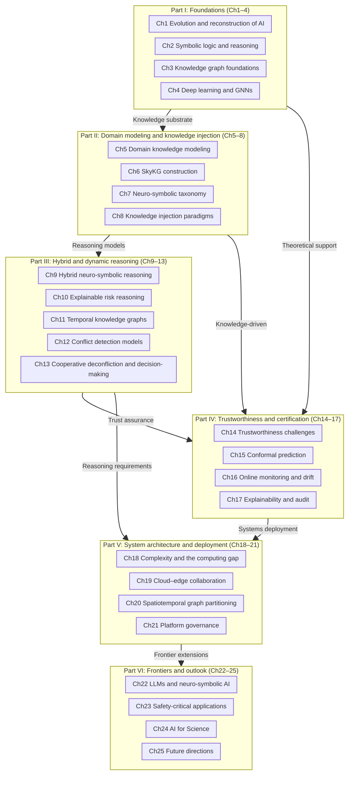
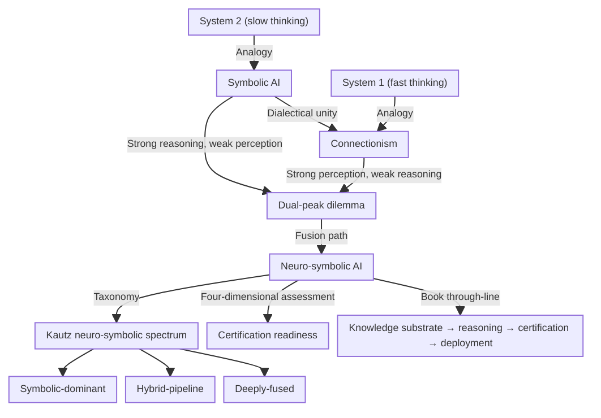
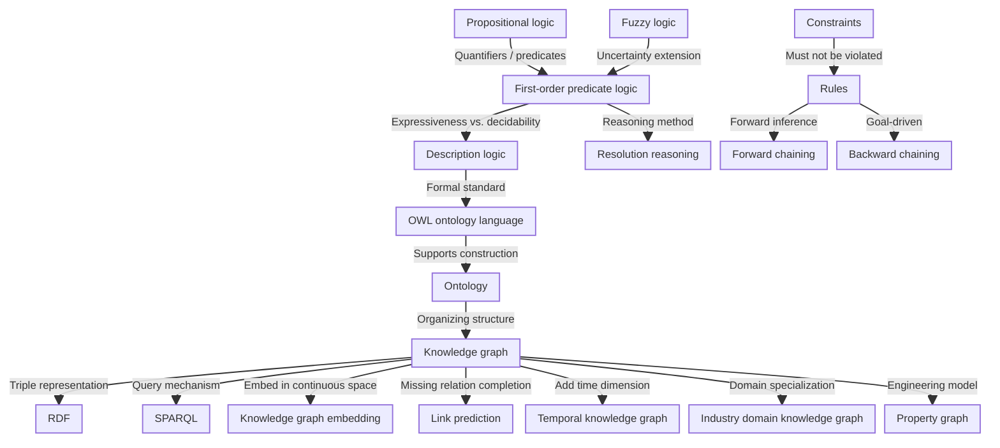
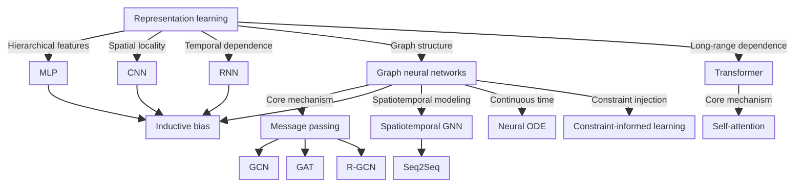
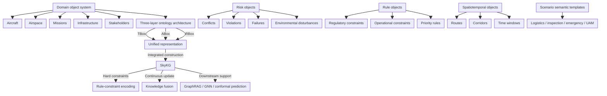
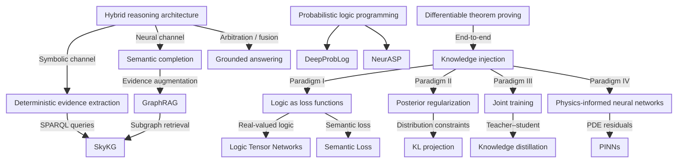
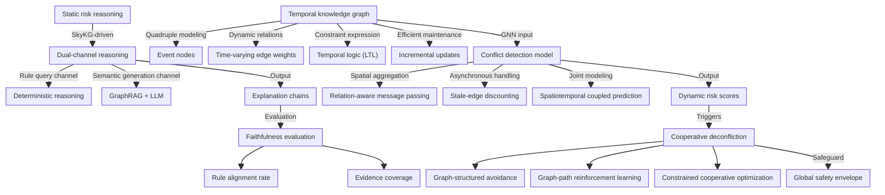

# Book Relationship Map (Knowledge Graph View)

> **Reading guide.** This note is an English, knowledge-graph–oriented companion to the Chinese edition’s relationship map. It uses Obsidian-style `[[double brackets]]` for conceptual anchors (standalone readable; links need not resolve to separate notes) and Mermaid diagrams to show how the book’s 25 chapters and core ideas connect.

---

## Whole-book structure overview

---

## 1. Evolution of AI paradigms

> **Chapters:** 1, 7

**Concept links:**
- [[Symbolic AI]] and [[Connectionism]] are the two major paradigms; their complementary strengths define the [[Dual-peak dilemma]].
- [[System 1 and System 2]] cognitive theory analogizes fast vs. slow thinking with connectionism vs. symbolic AI.
- [[Neuro-symbolic AI]] is the central path beyond the dual-peak dilemma and runs through the book.
- The [[Kautz neuro-symbolic spectrum]] classifies integration as [[Symbolic-dominant]], [[Hybrid-pipeline]], and [[Deeply-fused]] engineering layers.
- [[Certification readiness]] evaluates design choices along explainability, latency, scalability, and certification dimensions.

---

## 2. Logical reasoning and knowledge representation

> **Chapters:** 2, 3

**Concept links:**
- [[Propositional logic]] → [[First-order predicate logic]] → [[Description logic]] form a ladder of logical representation.
- [[Description logic]] underpins the [[OWL ontology language]]; [[Ontology]] supplies schema and axioms for the [[Knowledge graph]].
- The [[Knowledge graph]] uses [[RDF]] as a substrate and [[SPARQL]] as the query interface.
- [[Rules]] and [[Constraints]], together with [[Forward chaining]] / [[Backward chaining]], yield auditable inference chains.
- [[Resolution reasoning]] is central to automated theorem proving.
- [[Fuzzy logic]] extends logic for uncertain inference.
- [[Knowledge graph embedding]] (TransE, DistMult, ComplEx, RotatE) maps discrete symbols to continuous vectors.
- [[Link prediction]] supports graph completion; [[Temporal knowledge graph]] adds time; [[Property graph]] is a common engineering model.

---

## 3. Deep learning and graph neural networks

> **Chapter:** 4

**Concept links:**
- [[Representation learning]] is central to deep learning; architectures embody different [[Inductive bias]] assumptions.
- [[Graph neural networks]] use [[Message passing]], giving rise to [[GCN]], [[GAT]], [[R-GCN]], and related variants.
- The [[Transformer]] uses [[Self-attention]] for long-range dependencies and underpins large language models.
- [[Spatiotemporal GNN]] combines spatial graph convolution with temporal modeling ([[Seq2Seq]]) for dynamic settings.
- [[Neural ODE]] supports continuous-time dynamics.
- [[Constraint-informed learning]] injects knowledge and physical laws into neural nets—a key neuro-symbolic interface.

---

## 4. Domain modeling and SkyKG

> **Chapters:** 5, 6

**Concept links:**
- The [[Domain object system]] comprises five skeletal classes, together with [[Risk objects]], [[Rule objects]], [[Spatiotemporal objects]], and [[Scenario semantic templates]] in a five-layer organization.
- The [[Three-layer ontology architecture]] (concept / instance / rule layers) provides a [[Unified representation]] framework.
- [[SkyKG]] is the unified domain knowledge substrate, supporting later [[GraphRAG]], [[GNN]], and conformal-prediction mechanisms.
- [[Rule-constraint encoding]] separates hard constraints (Datalog / first-order logic) from soft constraints (e.g., MLN / PSL).
- [[Knowledge fusion]] spans acquisition, cleaning, mapping, alignment, and continuous refresh.

---

## 5. Knowledge injection and neuro-symbolic fusion

> **Chapters:** 7, 8, 9

**Concept links:**
- Four paradigms of [[Knowledge injection]]: [[Logic as loss functions]], [[Posterior regularization]], [[Joint training]] ([[Knowledge distillation]]), and [[Physics-informed neural networks]].
- [[Logic Tensor Networks]] and [[Semantic Loss]] exemplify logic-as-loss.
- The [[Hybrid reasoning architecture]] splits into a symbolic channel ([[Deterministic evidence extraction]]) and a neural channel ([[Semantic completion]]), fused by arbitration into [[Grounded answering]].
- [[GraphRAG]] retrieves entity–relation subgraphs from [[SkyKG]], replacing flat document retrieval to improve faithfulness.
- [[Probabilistic logic programming]] ([[DeepProbLog]], [[NeurASP]]) and [[Differentiable theorem proving]] enable end-to-end neuro-symbolic fusion.

---

## 6. Dynamic reasoning and cooperative deconfliction

> **Chapters:** 10, 11, 12, 13

**Concept links:**
- [[Static risk reasoning]] is [[SkyKG]]-driven; [[Dual-channel reasoning]] merges rules and semantics into [[Explanation chains]].
- [[Faithfulness evaluation]] uses [[Rule alignment rate]], [[Evidence coverage]], and related metrics for traceable explanations.
- The [[Temporal knowledge graph]] adds [[Event nodes]], [[Time-varying edge weights]], and [[Temporal logic (LTL)]] for dynamic settings.
- The [[Conflict detection model]] combines [[Relation-aware message passing]], [[Stale-edge discounting]], and [[Spatiotemporal coupled prediction]] to produce [[Dynamic risk scores]].
- [[Cooperative deconfliction]] includes [[Graph-structured avoidance]], [[Graph-path reinforcement learning]], and [[Constrained cooperative optimization]], guarded by a [[Global safety envelope]].
- [[Incremental updates]] refresh only affected subgraphs and avoid full recomputation.

---

## 7. Trustworthiness and certification

> **Chapters:** 14, 15, 16, 17

```mermaid
%%{init: {'flowchart': {'nodeSpacing': 8, 'rankSpacing': 18, 'padding': 5}, 'themeVariables': {'fontSize': '9px'}}}%%
graph TD
    G1["Trustworthiness challenges"] --> G2["Symbolic anchoring error"]
    G1 --> G3["Misplaced confidence"]
    G1 --> G4["Distribution shift"]
    G1 -->|"Key distinction"| G5["Explainability ≠ certifiability"]
    G5 -->|"Statistical methods"| G6["Conformal prediction"]
    G6 -->|"Core concept"| G7["Nonconformity score"]
    G6 -->|"Classification"| G8["Prediction sets"]
    G6 -->|"Regression"| G9["Prediction intervals"]
    G6 -->|"Graph extension"| G10["Network conformal prediction"]
    G6 -->|"Neural + symbolic"| G11["Composite conformal score"]
    G6 -->|"Coverage guarantee"| G12["Marginal coverage guarantee"]
    G13["Online monitoring"] -->|"Sequential testing"| G14["Martingale monitoring"]
    G13 -->|"Distribution change"| G15["Concept drift"]
    G13 -->|"Input anomalies"| G16["Anomaly / OOD detection"]
    G13 -->|"Output standard"| G17["Certification-grade outputs"]
    G17 -->|"Framework"| G18["SkyCert"]
    G18 -->|"Four-stage pipeline"| G19["Input alignment → statistical wrapping → online monitoring → governed output"]
    G20["Multi-level explanations"] --> G21["Local perceptual explanations"]
    G20 --> G22["Symbolic rule explanations"]
    G20 --> G23["Causal counterfactual explanations"]
    G24["Explanation quality"] --> G25["Faithfulness"]
    G24 --> G26["Sufficiency"]
    G24 --> G27["Understandability"]
    G28["Audit logs"] -->|"Dual-track recording"| G29["Input snapshots + reasoning traces + versioning"]
    G30["Trust calibration"] -->|"Mitigates"| G31["Automation bias"]
    G30 -->|"Degradation"| G32["Conservative rule mode"]
    G5 -->|"Regulatory alignment"| G33["DO-178C / SOTIF"]
```

**Concept links:**
- [[Trustworthiness challenges]] arise from [[Symbolic anchoring error]], [[Misplaced confidence]], and [[Distribution shift]].
- [[Explainability]] and [[Certifiability]] are distinct; the latter needs mathematical and institutional guarantees.
- [[Conformal prediction]] uses [[Nonconformity score]]s to produce [[Prediction sets]] / [[Prediction intervals]] with [[Marginal coverage guarantee]].
- [[Composite conformal score]] unifies neural error and symbolic violation penalties: $s = s_{\text{neural}} + \lambda P_{\text{symbolic}}$
- [[Online monitoring]] combines [[Martingale monitoring]], [[Concept drift]] detection, and [[Anomaly / OOD detection]] for runtime assurance.
- [[SkyCert]] wraps inference into [[Certification-grade outputs]].
- [[Multi-level explanations]] span local perception, symbolic rules, and causal counterfactuals.
- [[Audit logs]] and [[Trust calibration]] counter [[Automation bias]] and align with [[DO-178C]] and [[SOTIF]].

---

## 8. System architecture and deployment

> **Chapters:** 18, 19, 20, 21

```mermaid
%%{init: {'flowchart': {'nodeSpacing': 8, 'rankSpacing': 18, 'padding': 5}, 'themeVariables': {'fontSize': '9px'}}}%%
graph TD
    H1["Computing gap"] --> H2["Symbolic: combinatorial explosion"]
    H1 --> H3["GNN: neighborhood explosion"]
    H1 --> H4["LLM: autoregressive latency"]
    H1 -->|"Engineering response"| H5["Tiered deployment"]
    H5 --> H6["Device: rule checks"]
    H5 --> H7["Edge: GNN inference"]
    H5 --> H8["Cloud: LLM inference"]
    H9["Cloud–edge collaboration"] -->|"Architectural core"| H5
    H9 -->|"Scheduling"| H10["Event-driven scheduling"]
    H9 -->|"Consistency"| H11["Eventual consistency"]
    H9 -->|"Intervention chain"| H12["Real-time response loop"]
    H9 -->|"Migration"| H13["Cross-region handoff"]
    H14["Spatiotemporal-aware graph partitioning"] -->|"Overlap"| H15["Boundary buffers"]
    H14 -->|"Execution engine"| H16["Hybrid parallel pipeline"]
    H14 -->|"Scheduling"| H17["Structure-aware load balancing"]
    H14 -->|"Engineering substrate"| H18["SkyGrid"]
    H19["Platform implementation"] -->|"Design principles"| H20["Modular design"]
    H19 -->|"Core idea"| H21["Three-flow unification"]
    H21 --> H22["Data flow"]
    H21 --> H23["Control flow"]
    H21 --> H24["Evidence flow"]
    H19 -->|"Interaction layer"| H25["Multi-role interfaces"]
    H19 -->|"Closed loop"| H26["Governance closed loop"]
    H1 -->|"Compression"| H27["Model compression / distillation"]
    H5 -->|"Real-time"| H28["Hard real-time constraints"]
```

**Concept links:**
- The [[Computing gap]] reflects combinatorial explosion in symbolic reasoning, [[Neighborhood explosion]] in GNNs, and autoregressive latency in LLMs.
- [[Tiered deployment]] (device–edge–cloud) bridges the gap, together with [[Model compression]] / [[Knowledge distillation]].
- Under [[Cloud–edge collaboration]], [[Event-driven scheduling]] avoids global polling; [[Eventual consistency]] supports distributed sync.
- The [[Real-time response loop]] links risk detection, actuation, and logging.
- [[Spatiotemporal-aware graph partitioning]] uses [[Boundary buffers]] to reduce cross-partition seams; [[Hybrid parallel pipeline]] supports high concurrency.
- [[SkyGrid]] orchestrates reasoning, governance, and elasticity at city scale.
- [[Platform implementation]] uses [[Three-flow unification]] (data, control, evidence) and [[Modular design]] to build a [[Governance closed loop]].
- [[Hard real-time constraints]] are non-negotiable in safety-critical systems.

---

## 9. Frontiers and applications

> **Chapters:** 22, 23, 24, 25

```mermaid
%%{init: {'flowchart': {'nodeSpacing': 8, 'rankSpacing': 18, 'padding': 5}, 'themeVariables': {'fontSize': '9px'}}}%%
graph TD
    I1["Large language models (LLMs)"] -->|"Cognitive role"| I2["LLM as System 1"]
    I1 -->|"Formal compilation"| I3["NL-to-logic compilation"]
    I1 -->|"Knowledge augmentation"| I4["GraphRAG"]
    I1 -->|"Capability extension"| I5["Tool use"]
    I1 -->|"Agent"| I6["Neuro-symbolic agent"]
    I6 -->|"Closed loop"| I7["Perceive → retrieve → reason → act"]
    I3 -->|"Output"| I8["SPARQL / Datalog"]
    I9["Safety-critical scenarios"] --> I10["Autonomous driving"]
    I9 --> I11["Medical diagnosis"]
    I9 --> I12["Industrial control"]
    I9 --> I13["Low-altitude traffic"]
    I10 -->|"Core methods"| I14["Scene-graph understanding"]
    I11 -->|"Core methods"| I15["Guideline-driven reasoning"]
    I12 -->|"Core methods"| I16["Mechanism-constrained diagnosis"]
    I13 -->|"Core methods"| I17["SkyKG + GNN + conformal prediction"]
    I9 -->|"Critical leap"| I18["From demo-ready to deployment-ready"]
    I19["AI for Science"] --> I20["Scientific knowledge graphs"]
    I19 --> I21["Mechanism learning"]
    I19 --> I22["Symbolic regression"]
    I19 --> I23["Hybrid surrogate models"]
    I19 --> I24["Science Agent"]
    I21 -->|"Representative"| I25["PINNs"]
    I26["Future directions"] --> I27["World models"]
    I26 --> I28["Certification-grade trustworthy AI"]
    I26 --> I29["City-scale real-time governance"]
    I26 --> I30["Cross-industry transfer"]
    I26 -->|"Ladder"| I31["Explainable → certifiable → governable → deployable"]
```

**Concept links:**
- [[Large language models (LLMs)]] are positioned as [[System 1 (fast thinking)]], complementing symbolic rules (System 2).
- [[NL-to-logic compilation]] maps natural language to formal languages; [[GraphRAG]] supplies structured evidence.
- [[Tool use]] lets LLMs plan while numerics and logic are delegated externally.
- The [[Neuro-symbolic agent]] runs a perceive–retrieve–reason–act loop within rule boundaries.
- [[Safety-critical scenarios]] in four domains map to [[Scene-graph understanding]], [[Guideline-driven reasoning]], [[Mechanism-constrained diagnosis]], and related stacks.
- [[From demo-ready to deployment-ready]] captures the adoption barrier in safety-critical AI.
- [[AI for Science]] combines [[Scientific knowledge graphs]], [[Mechanism learning]] ([[PINNs]]), [[Symbolic regression]], [[Hybrid surrogate models]], and [[Science Agent]].
- [[World models]] unify environmental state and dynamics.
- The [[Long-term neuro-symbolic roadmap]]: explainable → certifiable → governable → deployable.

---

## 10. Cross-chapter concept chains

Key through-lines, each annotated with chapters.

### Knowledge representation thread
[[Propositional logic]] (Ch2) → [[First-order predicate logic]] (Ch2) → [[Description logic]] (Ch2) → [[OWL ontology language]] (Ch2/3) → [[Ontology]] (Ch3) → [[Knowledge graph]] (Ch3) → [[SkyKG]] (Ch6) → [[Temporal knowledge graph]] (Ch11)

### Neural architecture thread
[[Representation learning]] (Ch4) → [[Graph neural networks]] (Ch4) → [[Message passing]] (Ch4) → [[GAT]] (Ch4/12) → [[Spatiotemporal GNN]] (Ch4/12) → [[Conflict detection model]] (Ch12) → [[Dynamic risk scores]] (Ch12)

### Fusion and reasoning thread
[[Knowledge injection]] (Ch8) → [[Logic as loss functions]] (Ch8) → [[Hybrid reasoning architecture]] (Ch9) → [[Dual-channel reasoning]] (Ch10) → [[GraphRAG]] (Ch9/10/22) → [[Grounded answering]] (Ch9) → [[Explanation chains]] (Ch10)

### Dynamic reasoning loop
[[Temporal knowledge graph]] (Ch11) → [[Event nodes]] (Ch11) → [[Incremental updates]] (Ch11) → [[Conflict detection model]] (Ch12) → [[Dynamic risk scores]] (Ch12) → [[Cooperative deconfliction]] (Ch13) → [[Global safety envelope]] (Ch13)

### Trust and certification thread
[[Trustworthiness challenges]] (Ch14) → [[Misplaced confidence]] (Ch14) → [[Conformal prediction]] (Ch15) → [[Composite conformal score]] (Ch15) → [[Online monitoring]] (Ch16) → [[Martingale monitoring]] (Ch16) → [[Certification-grade outputs]] (Ch16) → [[SkyCert]] (Ch16)

### Explanation and audit thread
[[Multi-level explanations]] (Ch17) → [[Faithfulness]] (Ch10/17) → [[Audit logs]] (Ch17) → [[Trust calibration]] (Ch17) → [[DO-178C]] (Ch17/23) → [[SOTIF]] (Ch17/23) → [[Certification-grade trustworthy AI]] (Ch25)

### Systems deployment thread
[[Computing gap]] (Ch18) → [[Tiered deployment]] (Ch18) → [[Cloud–edge collaboration]] (Ch19) → [[Event-driven scheduling]] (Ch19) → [[Spatiotemporal-aware graph partitioning]] (Ch20) → [[SkyGrid]] (Ch20) → [[Platform implementation]] (Ch21) → [[Governance closed loop]] (Ch21)

### LLM integration thread
[[Large language models (LLMs)]] (Ch22) → [[NL-to-logic compilation]] (Ch22) → [[Tool use]] (Ch22) → [[Neuro-symbolic agent]] (Ch22) → [[Safety-critical scenarios]] (Ch23) → [[From demo-ready to deployment-ready]] (Ch23)

### Science and future thread
[[AI for Science]] (Ch24) → [[Scientific knowledge graphs]] (Ch24) → [[Mechanism learning]] (Ch24) → [[Symbolic regression]] (Ch24) → [[Hybrid surrogate models]] (Ch24) → [[World models]] (Ch25) → [[Long-term neuro-symbolic roadmap]] (Ch25)

---

## Chapter-by-chapter concept index

### Chapter 1 — The evolution, fracture, and reconstruction of AI
- [[Symbolic AI]] · [[Connectionism]] · [[Dual-peak dilemma]] · [[System 1 and System 2]] · [[Neuro-symbolic AI]]

### Chapter 2 — Symbolic logic, rule systems, and automated reasoning foundations
- [[Propositional logic]] · [[First-order predicate logic]] · [[Rules]] · [[Constraints]] · [[Forward chaining]] · [[Backward chaining]] · [[Resolution reasoning]] · [[Description logic]] · [[Fuzzy logic]]

### Chapter 3 — Knowledge graphs and domain knowledge representation
- [[Knowledge graph]] · [[RDF]] · [[OWL ontology language]] · [[SPARQL]] · [[Ontology]] · [[Temporal knowledge graph]] · [[Industry domain knowledge graph]] · [[Knowledge graph embedding]] · [[Link prediction]] · [[Property graph]]

### Chapter 4 — Deep learning, graph learning, and neural representation
- [[Representation learning]] · [[Inductive bias]] · [[Graph neural networks]] · [[Message passing]] · [[GCN]] · [[GAT]] · [[R-GCN]] · [[Transformer]] · [[Self-attention]] · [[Spatiotemporal GNN]] · [[Neural ODE]] · [[Constraint-informed learning]]

### Chapter 5 — Domain knowledge modeling for trustworthy governance in low-altitude traffic
- [[Domain object system]] · [[Risk objects]] · [[Rule objects]] · [[Spatiotemporal objects]] · [[Scenario semantic templates]]

### Chapter 6 — Low-altitude traffic knowledge graph construction and unified representation
- [[Three-layer ontology architecture]] · [[Unified representation]] · [[Rule-constraint encoding]] · [[Knowledge fusion]] · [[SkyKG]]

### Chapter 7 — Taxonomy and technology roadmap for neuro-symbolic systems
- [[Kautz neuro-symbolic spectrum]] · [[Symbolic-dominant]] · [[Hybrid-pipeline]] · [[Deeply-fused]] · [[Certification readiness]]

### Chapter 8 — Basic paradigms of knowledge injection and constrained learning
- [[Logic as loss functions]] · [[Posterior regularization]] · [[Joint training]] · [[Knowledge distillation]] · [[Physics-informed neural networks]] · [[Logic Tensor Networks]] · [[Semantic Loss]] · [[DeepProbLog]] · [[NeurASP]] · [[Differentiable theorem proving]]

### Chapter 9 — Knowledge-graph-driven hybrid neuro-symbolic reasoning
- [[Deterministic evidence extraction]] · [[Semantic completion]] · [[RAG]] · [[GraphRAG]] · [[Grounded answering]]

### Chapter 10 — Design of an explainable risk reasoning framework
- [[Static risk reasoning]] · [[Dual-channel reasoning]] · [[Explanation chains]] · [[Faithfulness evaluation]] · [[Rule alignment rate]] · [[Evidence coverage]]

### Chapter 11 — Temporal knowledge graphs and dynamic relational reasoning
- [[Temporal knowledge graph]] · [[Event nodes]] · [[Time-varying edge weights]] · [[Temporal logic (LTL)]] · [[Incremental updates]]

### Chapter 12 — Graph-driven multi-agent conflict detection models
- [[Conflict detection model]] · [[Relation-aware message passing]] · [[Stale-edge discounting]] · [[Spatiotemporal coupled prediction]] · [[Dynamic risk scores]]

### Chapter 13 — Cooperative deconfliction and decision-making on temporal relational graphs
- [[Cooperative deconfliction]] · [[Graph-structured avoidance]] · [[Graph-path reinforcement learning]] · [[Constrained cooperative optimization]] · [[Global safety envelope]]

### Chapter 14 — Trustworthiness issues in neuro-symbolic systems
- [[Symbolic anchoring error]] · [[Explainability]] · [[Certifiability]] · [[Misplaced confidence]] · [[Distribution shift]] · [[Formal assurance]]

### Chapter 15 — Conformal prediction and uncertainty calibration
- [[Uncertainty calibration]] · [[Conformal prediction]] · [[Nonconformity score]] · [[Prediction sets]] · [[Prediction intervals]] · [[Network conformal prediction]] · [[Composite conformal score]] · [[Marginal coverage guarantee]]

### Chapter 16 — Online monitoring, distribution drift, and statistical certification
- [[Online monitoring]] · [[Martingale monitoring]] · [[Concept drift]] · [[Anomaly / OOD detection]] · [[Certification-grade outputs]] · [[SkyCert]]

### Chapter 17 — Explainability evaluation, audit trails, and regulatory interfaces
- [[Multi-level explanations]] · [[Faithfulness]] · [[Sufficiency]] · [[Understandability]] · [[Audit logs]] · [[Trust calibration]] · [[Automation bias]] · [[DO-178C]] · [[SOTIF]]

### Chapter 18 — Complexity of neuro-symbolic reasoning and the computing gap
- [[Computing gap]] · [[Neighborhood explosion]] · [[Hard real-time constraints]] · [[Availability-oriented design]] · [[Tiered deployment]] · [[Model compression]]

### Chapter 19 — Distributed reasoning under cloud–edge collaboration
- [[Cloud–edge collaboration]] · [[Event-driven scheduling]] · [[Eventual consistency]] · [[Real-time response loop]] · [[Cross-region handoff]]

### Chapter 20 — Spatiotemporal graph partitioning and high-concurrency reasoning engines
- [[Spatiotemporal-aware graph partitioning]] · [[Boundary buffers]] · [[Hybrid parallel pipeline]] · [[Structure-aware load balancing]] · [[SkyGrid]]

### Chapter 21 — Platformization: from model stacking to a governance closed loop
- [[Platform implementation]] · [[Modular design]] · [[Three-flow unification]] · [[Multi-role interfaces]] · [[Governance closed loop]]

### Chapter 22 — Neuro-symbolic AI in the LLM era
- [[Large language models (LLMs)]] · [[NL-to-logic compilation]] · [[GraphRAG]] · [[Tool use]] · [[Neuro-symbolic agent]]

### Chapter 23 — Safety-critical industry applications
- [[Safety-critical scenarios]] · [[Scene-graph understanding]] · [[Guideline-driven reasoning]] · [[Mechanism-constrained diagnosis]] · [[From demo-ready to deployment-ready]]

### Chapter 24 — Neuro-symbolic reasoning for AI for Science
- [[Scientific knowledge graphs]] · [[Mechanism learning]] · [[Symbolic regression]] · [[Hybrid surrogate models]] · [[Science Agent]] · [[PINNs]]

### Chapter 25 — The future of neuro-symbolic reasoning
- [[World models]] · [[Certification-grade trustworthy AI]] · [[City-scale real-time governance]] · [[Cross-industry transfer]] · [[Long-term neuro-symbolic roadmap]]
