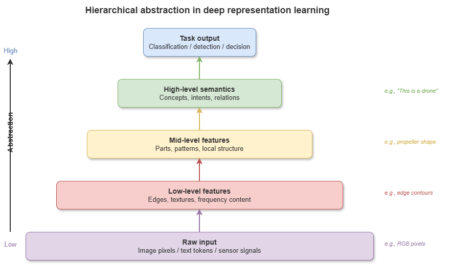
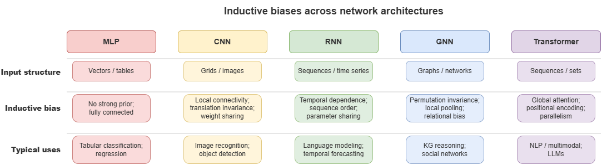
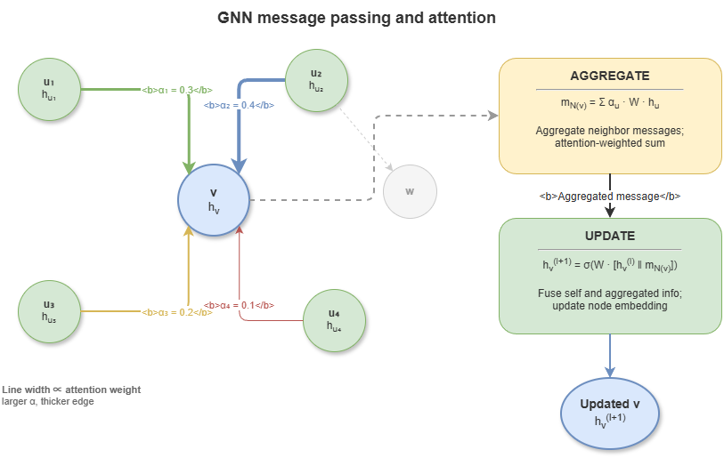

Chapters 2–3 (logic, KGs) foreground “System 2” cognition—highly interpretable with tight inference chains but often weak on **high-dimensional, continuous, noisy** perception. True neuro-symbolic fusion requires “System 1”—the connectionist paradigm centered on **deep learning**. This chapter surveys **deep representation learning**, **graph neural networks**, and **temporal modeling**, and analyzes intrinsic limits of purely data-driven models—preparing for **injecting symbolic knowledge** into neural nets and moving toward **constrained learning**.

## 4.1 Basic ideas of deep representation learning

Classical machine learning relied heavily on **feature engineering**—hard for radar point clouds, high-rate ADS-B tracks, video streams, and similar low-altitude sensing data. Deep learning’s breakthrough is **representation learning**: multi-layer nonlinear transforms that learn **hierarchical** features from low-level cues (edges, track segments) to high-level semantics (conflict patterns, flight intent).

In neural representation, discrete entities and continuous signals map to **high-dimensional embeddings**—dense vectors preserving latent semantic similarity and enabling **end-to-end** optimization by backpropagation across classification, regression, and prediction tasks.

## 4.2 Inductive biases of neural networks and function approximation

The **universal approximation theorem** states that feedforward nets with enough hidden units and nonlinear activations can approximate any continuous function arbitrarily well. With finite data, perfect maps are unrealistic; **inductive biases** in architecture improve generalization:

- **Multilayer perceptron (MLP):** weak bias—any feature interactions possible.
- **Convolutional neural network (CNN):** **locality** and **translation equivariance/invariance**—suited to grid-like data (e.g. raster maps of static obstacles in urban low altitude).
- **Recurrent neural network (RNN):** **temporal dependence**—current state strongly depends on history.

Choosing perception and prediction modules in neuro-symbolic systems requires understanding these biases.

## 4.3 Graph neural networks: message passing, relational modeling, graph representation

Low-altitude traffic is inherently a **network**: UAS and cells as nodes; communication links, spatial proximity, and organizational relations as edges. Standard CNNs/RNNs do not natively handle **non-Euclidean** graph data.

**Graph neural networks (GNNs)** target relational data. Core mechanism: **message passing**. In layer $l{+}1$, node $v$’s features $h_v^{(l+1)}$ depend on its previous features $h_v^{(l)}$ and aggregated neighbor messages from $\mathcal{N}(v)$:

$$h_v^{(l+1)} = \mathrm{UPDATE}\!\left(h_v^{(l)},\;\mathrm{AGGREGATE}\!\left(\{h_u^{(l)} \mid u \in \mathcal{N}(v)\}\right)\right)$$

Repeated rounds capture graph topology. In KG-driven reasoning, GNNs (e.g. R-GCN, GAT) learn entity embeddings and embed **logical relation types** on edges, linking **discrete symbolic graphs** to **continuous computational graphs**.

## 4.4 Transformer and attention mechanisms

**Transformers** have reshaped deep learning—unifying much of NLP and spreading to vision and time series. The key is **self-attention**.

Unlike RNN recurrence, self-attention computes relevance weights between **all** pairs in a sequence, enabling **global, parallel** modeling of long-range dependence:

$$\mathrm{Attention}(Q, K, V) = \mathrm{softmax}\!\left(\frac{QK^\top}{\sqrt{d_k}}\right)V$$

For low-altitude governance, Transformers help: **long-horizon multi-UAS trajectory prediction** with attention highlighting high-threat neighbors; as the backbone of **LLMs**, they also support parsing natural-language aviation rules into structured constraints.

## 4.5 Temporal modeling and learning dynamical systems

Safety-critical systems **evolve over time**. **Temporal modeling** predicts future evolution from historical state sequences.

- **Sequence-to-sequence (seq2seq)** models: trajectory and intent prediction—encoder summarizes history; decoder autoregressively predicts future tracks.
- **Spatiotemporal GNNs:** combine GNNs (space) with temporal modules (e.g. GRU, TCN)—e.g. GCN over airspace grid adjacency plus temporal dynamics per cell for traffic-flow prediction.
- **Neural ODEs:** for vehicles with clear kinematics, coupling nets with ODEs can model **continuous-time** dynamics precisely.

## 4.6 Limits of deep learning: OOD behavior, hallucination, catastrophic forgetting, fragility

Despite successes, applying deep models directly to **safety-critical** low-altitude traffic exposes failures that drive the “two-peaks dilemma”:

1. **Out-of-distribution (OOD) generalization:** deep models behave like advanced **statistical interpolators**; under unseen extreme weather or rare interaction patterns, performance can **collapse**.
2. **Hallucination:** LLMs in particular can generate fluent but **false** instructions or explanations—unacceptable in aviation.
3. **Catastrophic forgetting:** continual learning of new tasks can **erase** critical prior knowledge (e.g. basic separation rules).
4. **Black boxes and adversarial fragility:** billions of parameters resist human logical review; **tiny adversarial or sensor** perturbations can yield catastrophic decisions.

## 4.7 From deep models to constrained learning

The response is not to discard deep learning but to **rein it in**.

**Constrained learning** is a core entry point for neuro-symbolic AI: instead of unbounded parameter search, inject **prior knowledge, physical laws, and regulatory rules** from Chapter 3’s knowledge base as **hard or soft constraints** in losses, architectures, or decoders—e.g. energy balance, minimum separation standards.

Only when continuous neural representations run inside **strict discrete logical frames** can next-generation systems combine **rich perception** with **interpretable, verifiable, trustworthy** behavior—setting up later hybrid neuro-symbolic reasoning.

## 4.8 Supplement: graph Transformers, over-smoothing, and positional encodings

### 4.8.1 Graph Transformer

After Transformers’ success in NLP and vision, **graph Transformers** merge Transformer attention with graph structure. Classical GNNs rely on local message passing with **limited receptive fields**; graph Transformers treat nodes as sequence tokens with **global** self-attention, often **biasing** attention with topology—combining GNN-like **structural inductive bias** with Transformer **global modeling**.

Graphormer, SAN (Spectral Attention Network), GPS (General, Powerful, Scalable Graph Transformer), among others, lead benchmarks. For neuro-symbolic systems, unifying **local logical chaining** along KG edges with **long-range** semantic patterns is especially valuable.

### 4.8.2 GNN over-smoothing

**Over-smoothing:** deep message passing expands receptive fields; with too many layers, node representations **collapse** toward similar values, losing discriminability—analogous to repeated Laplacian smoothing on graphs.

Practical GNN depth often stays modest (roughly 4–8 layers). Mitigations include **residual connections**, **Jumping Knowledge (JK)** aggregation across layers, **graph normalization**, and **DropEdge** (random edge dropout). In dynamic low-altitude graphs, these choices affect whether models retain **depth** and **node-level** distinction under complex topology.

### 4.8.3 Positional encodings for graphs

Unlike sequences, graphs lack canonical node orderings; standard GNNs struggle to distinguish **structurally similar but functionally different** nodes (related to 1-WL expressivity limits). **Graph positional encodings (PEs)** inject structural position:

- **Laplacian PE:** first $k$ eigenvectors of the graph Laplacian as node features.
- **Random-walk PE:** $k$-step return probabilities summarizing local structural role.

PEs are central in graph Transformers—e.g. distinguishing **hub waypoints** from **terminal vertiports** despite similar local connectivity.

### 4.8.4 Foundation models and graph learning

Inspired by LLMs, **graph foundation models** **pretrain** on large heterogeneous graphs with self-supervision, then **fine-tune** or **prompt** for downstream tasks—potentially cutting per-task training cost and supplying **robust base representations** for neuro-symbolic systems adapting to new airspace layouts and traffic patterns with limited labels.

## Chapter summary

This chapter positioned **deep learning, graph learning, and neural representation** as the indispensable connectionist pole of neuro-symbolic systems: hierarchical representations from deep nets; **inductive biases** in CNNs, RNNs, and beyond; **GNNs** for relational non-Euclidean data; **Transformers** and attention for long-range context; **temporal models** for prediction and control; and explicit limits—OOD behavior, hallucination, forgetting, opacity—motivating **knowledge constraints** and **constrained learning**.

## Key concepts

- **Representation learning:** learning layered features from data automatically.
- **Inductive bias:** architectural priors shaping what patterns are easy to learn.
- **Graph neural network:** family of models using message passing on graphs.
- **Transformer:** attention-centric architecture for long-range dependencies.
- **Constrained learning:** injecting rules, physics, or priors into training/inference.

## Discussion questions

1. Why are GNNs a natural fit for knowledge graphs and temporal relational graphs?
2. Why does inductive bias matter for model choice in safety-critical settings?
3. Without symbolic rules or knowledge constraints, what failure modes are most likely for pure deep models in low-altitude traffic?

## Case study

**Local multi-UAS conflict sensing:** compare an MLP on single-vehicle state with a **GNN** encoding neighbors and corridor relations; contrast conflict alerting, local interpretability, and behavior under **OOD** scenarios.

## Figure suggestions

- Figure 4-1: Hierarchical abstraction in deep representation learning.

- Figure 4-2: Inductive biases of MLP, CNN, RNN, GNN, Transformer.

- Figure 4-3: GNN message passing and attention schematic.

## Formula index

- GNN message passing: $h_v^{(l+1)} = \mathrm{UPDATE}\!\left(h_v^{(l)},\;\mathrm{AGGREGATE}\!\left(\{h_u^{(l)} \mid u \in \mathcal{N}(v)\}\right)\right)$
- Attention: $\mathrm{Attention}(Q, K, V) = \mathrm{softmax}\!\left(\dfrac{QK^\top}{\sqrt{d_k}}\right)V$
- Note: formulas highlight **graph propagation** and **global attention** as two core neural mechanisms.

## References

1. Hornik, K., Stinchcombe, M., & White, H. (1989). Multilayer Feedforward Networks Are Universal Approximators. *Neural Networks*, 2(5), 359–366.
2. Kipf, T. N., & Welling, M. (2017). Semi-Supervised Classification with Graph Convolutional Networks. *International Conference on Learning Representations* (ICLR).
3. Vaswani, A., Shazeer, N., Parmar, N., Uszkoreit, J., Jones, L., Gomez, A. N., Kaiser, Ł., & Polosukhin, I. (2017). Attention Is All You Need. *Advances in Neural Information Processing Systems* (NeurIPS).
4. Veličković, P., Cucurull, G., Casanova, A., Romero, A., Liò, P., & Bengio, Y. (2018). Graph Attention Networks. *International Conference on Learning Representations* (ICLR).
5. Gilmer, J., Schoenholz, S. S., Riley, P. F., Vinyals, O., & Dahl, G. E. (2017). Neural Message Passing for Quantum Chemistry. *Proceedings of the 34th International Conference on Machine Learning* (ICML).
6. Chen, R. T. Q., Rubanova, Y., Bettencourt, J., & Duvenaud, D. (2018). Neural Ordinary Differential Equations. *Advances in Neural Information Processing Systems* (NeurIPS).
7. Wu, Z., Pan, S., Chen, F., Long, G., Zhang, C., & Yu, P. S. (2021). A Comprehensive Survey on Graph Neural Networks. *IEEE Transactions on Neural Networks and Learning Systems*, 32(1), 4–24.
8. Goodfellow, I., Bengio, Y., & Courville, A. (2016). *Deep Learning*. MIT Press.
