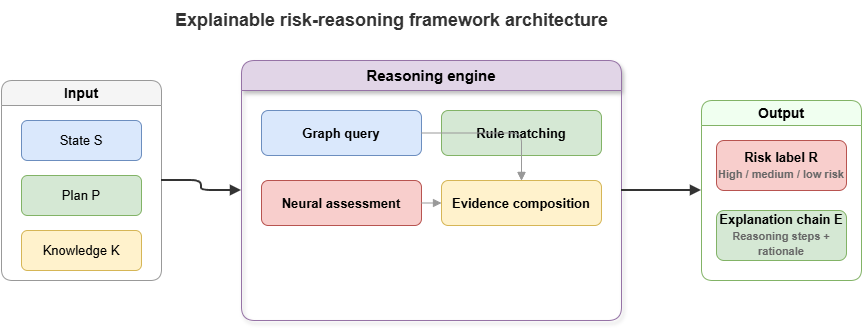
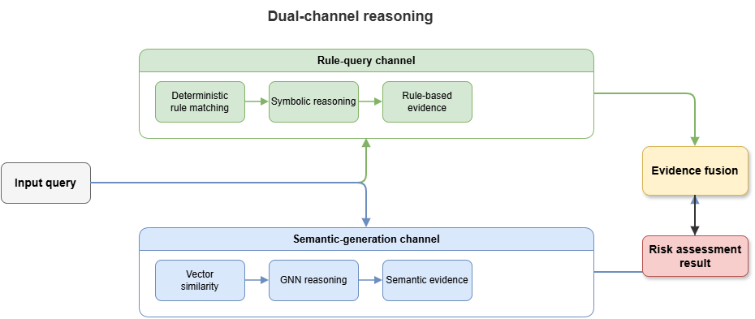
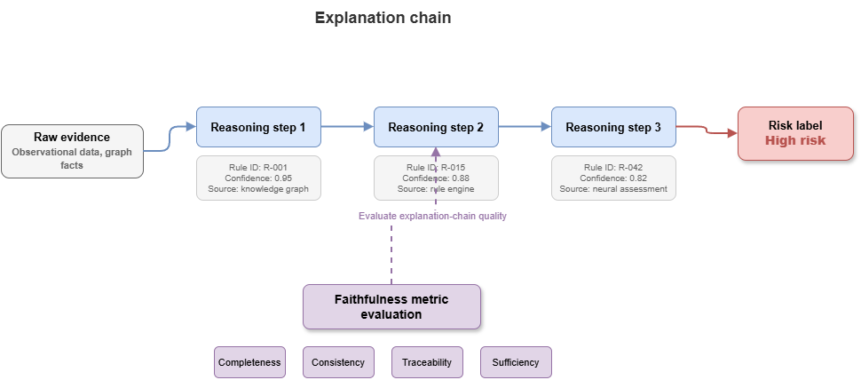

After Chapters 8–9 on knowledge injection and hybrid neuro-symbolic reasoning, this chapter turns to methodology: how to organize a **static, explainable risk-reasoning** framework. Using the low-altitude traffic graph (SkyKG) as substrate, we analyze dual-channel reasoning, joint production of risk labels and explanation chains, and quantitative faithfulness evaluation—yielding a deployable static-cognition architecture.

## 10.1 Defining static risk reasoning

In urban air mobility (UAM), **static risk reasoning** arises in pre-flight approval, static route planning, and post-hoc compliance audits. Unlike millisecond airborne deconfliction, it stresses **logical completeness and regulatory conformance**.

Formalize static risk reasoning as $f: (\mathcal{S}, \mathcal{P}, \mathcal{K}) \rightarrow (\mathcal{R}, \mathcal{E})$:

* **Current state ($\mathcal{S}$):** Aircraft performance, vertiport state, forecast weather—static or quasi-static.
* **Flight plan ($\mathcal{P}$):** Waypoints, schedule, mission type (e.g., logistics, medevac).
* **Domain knowledge ($\mathcal{K}$):** SkyKG—airspace topology, ground–air physics, CCAR aviation rules.
* **Risk label ($\mathcal{R}$):** Discrete safety classes, e.g., Pass (Safe), Manual review (Warning), Reject (Critical).
* **Explanation chain ($\mathcal{E}$):** Logical argument steps and evidence sets supporting the label—central value of the framework.

## 10.2 Ontology + rules + retrieval indexes in concert

To let LLM-centric modules use SkyKG effectively, the substrate needs **reasoning-oriented organization**. Raw graph queries alone do not match NL semantics; a three-part stack helps:

1.  **Ontology indexing:** Project schema and metadata into structured prompts so models know which concepts exist and which relations are legal.
2.  **Rule base:** Hard regulations (e.g., “UAVs shall not enter civil airport obstacle limitation surfaces without exemption”) stored as Datalog or FOL, executed by discrete solvers—not interpreted solely by LLM semantics.
3.  **Vector–graph joint index:** For GraphRAG, slice graph instances and properties, embed them densely. On requests like “assess route compliance for UAV A01,” combine vector similarity (e.g., weather NOTAMs) with multi-hop structured hops (e.g., `A01 -> belongs_to -> Logistics_Company_X`).

## 10.3 Dual-channel reasoning: rule query vs. semantic generation

To balance **absolute accuracy (anti-hallucination)** and **semantic flexibility (rich context)**, use parallel **dual channels**:

* **Channel 1 — Rule query channel (deterministic symbolic reasoning)**  
    The “fast thinker” or **hard guard**: compile requests or plans into SPARQL or solver inputs, run deductive checks on SkyKG, flag hard physical conflicts (e.g., waypoints intersecting no-fly volumes) and clear regulatory violations. Outputs are **fully deterministic**; red-line hits yield immediate **reject** labels.

* **Channel 2 — Semantic generation channel (probabilistic neural reasoning)**  
    The “slow thinker”: when hard rules do not fire but **latent** compound risks remain (e.g., gust advisories along the corridor plus payload near limits), GraphRAG pulls entity subgraphs and attribute constraints as context for an LLM to chain-think (chain-of-thought) about composite risk.

An **arbiter** fuses channels: hard-rule negatives **veto**; LLM output enriches narrative and holistic compliance reporting.

## 10.4 Risk labels bound to explanation chains

Classical deep models often emit opaque risk scores (e.g., 95% collision probability). Here, **risk labels must be tightly coupled to an explanation chain**.

A sound chain contains:

1.  **Premises:** Concrete triples from SkyKG, e.g., `(UAV_1, max_wind_resistance, Level_5)`.
2.  **Applied rules:** Regulatory or ontology constraints, e.g., `Rule_102: If forecast wind at departure airspace exceeds aircraft wind resistance, takeoff is prohibited`.
3.  **Reasoning steps:** Logic combining premises and rules, e.g., “Forecast is Beaufort 6, exceeding max resistance 5.”
4.  **Conclusion:** Derived label (e.g., high risk / no takeoff).

Structured chains aid human reviewers (e.g., ATC) and strengthen trust and airworthiness-evidence potential.

## 10.5 Faithfulness: rule alignment, unsupported claims, evidence coverage

LLM generators risk **hallucination**. Quantitative **faithfulness** metrics include:

* **Rule alignment rate:** Consistency with Channel-1 symbolic outcomes. Solver says **violation** but LLM says **safe** ⇒ alignment collapses—severe failure.
* **Unsupported claim rate:** Share of factual statements in generated explanations **not** backed by retrieved subgraph evidence—lower is better.
* **Evidence coverage:** Fraction of critical retrieved facts **used** in the explanation—omitting retrieved severe weather, for example, lowers coverage.

Together they form a practical “golden trio” for static neuro-symbolic explanation quality.

## 10.6 Strengths and limits of static single-scenario frameworks

SkyKG-centric static reasoning turns black-box decisions into **auditable white-box reports**, easing trust for offline approval and admission testing—Layer 2’s most mature deployment path.

Limits:

1.  **Latency:** Heavy subgraph retrieval plus autoregressive LLM generation often lands at seconds to tens of seconds end-to-end.
2.  **High-frequency dynamics:** Winds and non-cooperative traffic evolve continuously; static stacks handle **snapshots**, not fast closed-loop control.

## 10.7 From static cognition to dynamic coordination

Pre-flight perfection meets real-world perturbation at takeoff. Dense urban swarms demand millisecond **fast decisions** instead of static **slow deliberation**.

If this chapter answers **how rules forestall known risks with explanations**, the next challenge is **how to foresee millisecond-scale unknown conflicts in spatiotemporally coupled networks and coordinate multi-UAV avoidance**. Knowledge graphs must become **temporal KGs (TKGs)**; reasoning cores must emphasize **GNNs** over LLMs for that regime.

Part IV (dynamic coordination) crosses that boundary toward real-time, multi-agent neuro-symbolic models.

## Chapter summary

We organized explainable static risk reasoning: formal mapping from state, plan, and knowledge to labels and chains; ontology, rules, and joint indexes; dual channels for deterministic checks vs. semantic elaboration; label–chain binding; faithfulness via alignment, unsupported-claim rate, and coverage; and static limits motivating TKGs and dynamic graph reasoning.

## Key concepts

- Static risk reasoning: Pre-flight approval, compliance, and offline audit tasks driven by knowledge.
- Dual-channel reasoning: Rule-query plus semantic-generation architecture.
- Explanation chain: Structured link among facts, rules, steps, and conclusions.
- Faithfulness evaluation: Metrics for evidence- and rule-grounded explanations.
- SkyKG methodology: KG-first design of static explainable risk reasoning.

## Study questions

1. Why bind **risk labels** and **explanation chains** as joint outputs?
2. Which tasks must stay in the rule channel, and which can the semantic channel augment?
3. If prose is fluent but unsupported-claim rate is high, is the system still trustworthy?

## Case study

Pre-flight static compliance review: rule channel for no-fly volumes, wind resistance, and permit conditions; semantic channel for NOTAMs and mission context; joint output Pass / Review / Reject with full chains.

## Figure suggestions

- Figure 10-1: Overall static risk-reasoning architecture.

- Figure 10-2: Dual-channel cooperation—rule query vs. semantic generation.

- Figure 10-3: Mapping labels, evidence chains, and faithfulness metrics.

## Formula index

- Static risk mapping: $f: (\mathcal{S}, \mathcal{P}, \mathcal{K}) \rightarrow (\mathcal{R}, \mathcal{E})$
- $\mathcal{S}$: state; $\mathcal{P}$: plan; $\mathcal{K}$: knowledge substrate; $\mathcal{R}$: risk label; $\mathcal{E}$: explanation chain.
- Faithfulness emphasizes metric–chain correspondence rather than heavy derivation.

## References

1. Ribeiro, M. T., Singh, S., & Guestrin, C. (2016). "Why Should I Trust You?": Explaining the Predictions of Any Classifier. *Proceedings of the 22nd ACM SIGKDD International Conference on Knowledge Discovery and Data Mining* (KDD).
2. Lundberg, S. M., & Lee, S.-I. (2017). A Unified Approach to Interpreting Model Predictions. *Advances in Neural Information Processing Systems* (NeurIPS).
3. Lewis, P., et al. (2020). Retrieval-Augmented Generation for Knowledge-Intensive NLP Tasks. *Advances in Neural Information Processing Systems* (NeurIPS).
4. Wei, J., et al. (2022). Chain-of-Thought Prompting Elicits Reasoning in Large Language Models. *Advances in Neural Information Processing Systems* (NeurIPS).
5. Hogan, A., et al. (2021). Knowledge Graphs. *ACM Computing Surveys*, 54(4), Article 71.
6. Doshi-Velez, F., & Kim, B. (2017). Towards a Rigorous Science of Interpretable Machine Learning. *arXiv preprint arXiv:1702.08608*.
