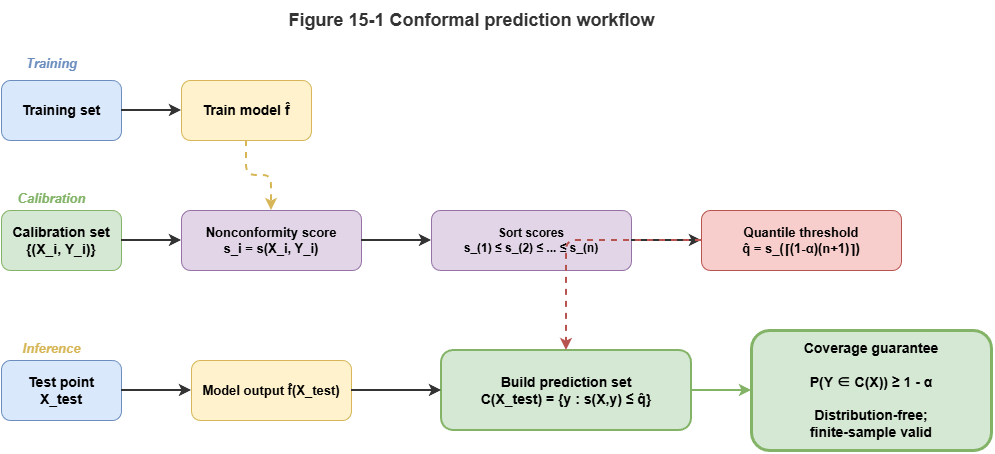
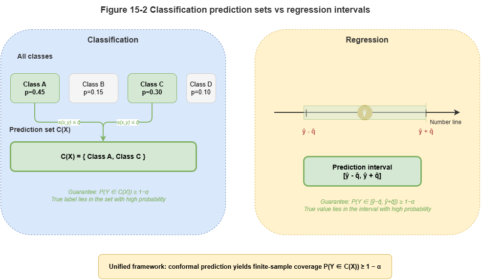
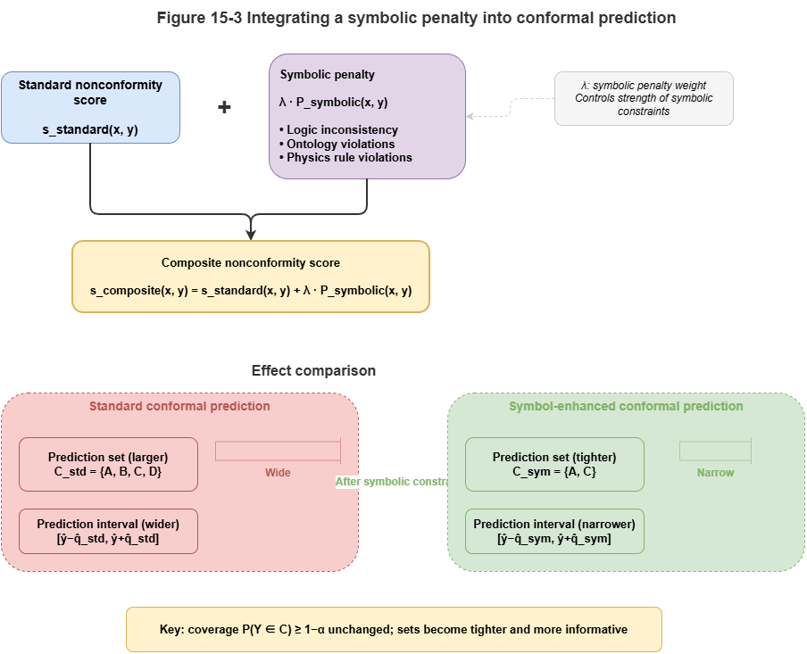

The previous chapter dissected the trustworthiness crisis of neuro-symbolic systems in safety-critical settings and clarified that explainability is not certifiability. To qualify for airworthiness or deployment, we must move from classical **point prediction** to interval prediction with rigorous statistical guarantees. This chapter introduces **conformal prediction (CP)** and systematically discusses calibrating model uncertainty so that black-box or gray-box outputs carry mathematically valid coverage guarantees.

## 15.1 Types of Uncertainty: Epistemic vs. Aleatoric

Before calibrating outputs, we separate two sources of uncertainty:

* **Aleatoric uncertainty (data uncertainty):** Inherent, irreducible noise in the physical world—e.g., sensor error (ADS-B, radar), sudden wind shear in low-altitude traffic. This is an intrinsic property of the system and **cannot be removed by more training data**.
* **Epistemic uncertainty (model uncertainty):** The model “does not know enough” about the observed scene—e.g., it trained only on multirotor UAVs and then sees a novel eVTOL. Lacking data, it cannot be sure of its prediction. This uncertainty **can be reduced by more relevant data or richer prior knowledge in the graph**.

In neuro-symbolic systems, symbolic rules often handle cases with clear epistemic boundaries; uncontrollable aleatoric noise and unknown blind spots require probabilistic methods to quantify and isolate.

## 15.2 Why Probability Outputs Are Not Trustworthy Confidence

In deep learning, Softmax outputs are often read as probabilities: “collision probability 0.99” feels highly confident. Modern networks, however, are widely **overconfident**.

Large capacity plus techniques such as batch normalization and weight decay encourages overfitting to labels: even when wrong, Softmax values are often near $1.0$. Empirical accuracy and reported probabilities decouple (**miscalibration**).

In low-altitude collision avoidance, feeding such uncalibrated “pseudo-probabilities” into a symbolic decision engine is dangerous. We need to turn “what the model thinks is confidence” into **reliably calibrated** confidence.

## 15.3 Basics of Conformal Prediction

**Conformal prediction (CP)** is a distribution-free method that, without assuming a specific model form or data law, yields **valid prediction sets or intervals** for arbitrary predictors.

Its main assumption is **exchangeability**: train and test data are drawn from the same distribution (in the usual i.i.d. setting, exchangeability holds).

Basic pipeline (**split conformal prediction**):

1. **Calibration set:** Hold out an independent calibration set $D_{cal} = \{(X_i, Y_i)\}_{i=1}^n$ unseen by the fitted model.
2. **Nonconformity score:** Define $s(X, Y)$ measuring how “strange” the pair is—higher means worse agreement with the model.
3. **Quantile:** Compute scores on the calibration set, sort ascending, take the $\lceil (n+1)(1-\alpha) \rceil$-th as threshold $\hat{q}$, where $\alpha$ is the tolerated error rate (e.g., $\alpha = 0.05$ for 95% confidence).
4. **Prediction set:** For test $X_{test}$, try candidate labels $y$; include $y$ in $C(X_{test})$ if $s(X_{test}, y) \le \hat{q}$.

Conformal prediction guarantees $P(Y_{test} \in C(X_{test})) \ge 1 - \alpha$.

## 15.4 Conformal Methods for Classification, Regression, and Set Prediction

CP adapts to different tasks:

* **Classification (e.g., risk levels):** Often $s(x, y) = 1 - \hat{\pi}_y(x)$ with $\hat{\pi}_y(x)$ the model’s class probability. For very small $\alpha$ (e.g., $0.01$), CP may return a **prediction set** such as `{safe, caution}`—acknowledging ambiguity and forcing worst-case conservative action.
* **Regression (e.g., continuous trajectories):** Often $s(x, y) = |y - \hat{y}(x)|$. After calibration, output is a **prediction interval** $[\hat{y}(x) - \hat{q}, \hat{y}(x) + \hat{q}]$—the envelope planners must respect.

## 15.5 Conformal Calibration for Graph and Temporal Models

In dynamic low-altitude collaboration (Part IV of this book), GNNs and temporal knowledge graphs (TKGs) strain classical exchangeability:

1. **Graph structure breaks spatial independence:** Neighbor UAVs interact via message passing; predictions are dependent. **Network conformal prediction** reweights quantiles using local topology.
2. **Time series break temporal independence:** Trajectories are autocorrelated and subject to **concept drift**. **Adaptive / sequential conformal prediction** updates calibration and $\hat{q}$ online from recent windows.

## 15.6 Designing Conformal Scores for Neuro-Symbolic Outputs

Neuro-symbolic systems fuse prior knowledge and rules. The nonconformity score $s(X, Y)$ should reflect both neural scores and SkyKG constraints.

A **composite conformal score with symbolic penalty**:

$$s(x, y) = s_{neural}(x, y) + \lambda \cdot P_{symbolic}(x, y)$$

Here $s_{neural}$ measures neural uncertainty; $P_{symbolic}$ is large if candidate $y$ violates hard physical rules or high-priority regulations in the graph (e.g., trajectory through a no-fly zone). Predictions that grossly violate domain knowledge are pushed out of the conformal set.

## 15.7 Risk Prediction Intervals and Coverage Guarantees

CP moves neuro-symbolic systems from empiricism to formal statements. For UAM safety, CP provides **marginal coverage**:

$$P(Y_{test} \in \hat{C}(X_{test})) \ge 1 - \alpha$$

If airworthiness requires miss rate below $10^{-4}$, set $\alpha = 10^{-4}$. Tighter safety yields wider sets in ambiguous scenes and more conservative avoidance—but the statistical promise is explicit.

CP supplies a quantifiable “confidence certificate” and aligns outputs with aviation-style assurance discussions (e.g., DO-178C analogues). Chapter 16 turns to online drift monitoring.

## 15.8 Supplement: Conditional CP, Classical Calibration, Bayes, and Engineering Challenges

### 15.8.1 Conditional conformal prediction

Standard CP gives **marginal coverage** $P(Y \in \hat{C}(X)) \ge 1 - \alpha$ averaged over $X$. That can hide local under-coverage (e.g., rare weather) while being overly conservative in easy regimes.

**Conditional conformal prediction** targets finer guarantees:

$$P(Y \in \hat{C}(X) \mid X \in \mathcal{G}_k) \ge 1 - \alpha, \quad \forall k$$

Examples:

- **Mondrian conformal prediction:** Partition inputs (e.g., vehicle type, airspace class); run CP separately per group with thresholds $\hat{q}_k$.
- **Localized CP:** Weight calibration points by proximity to the test point for local adaptation.

For safety-critical certification, **worst-case subpopulations** matter more than global averages.

### 15.8.2 Classical calibration methods

Post-hoc calibration alternatives include:

- **Temperature scaling:** Divide logits by learned scalar $T$ before Softmax.
- **Platt scaling:** Fit $\sigma(aZ + b)$ on logits.
- **Isotonic regression:** Nonparametric monotone mapping when data are ample.

These improve **expected calibration error (ECE)** but only retune point probabilities—they lack **finite-sample coverage guarantees** like CP. In strict certification, treat them as adjuncts, not replacements.

### 15.8.3 Bayesian approaches to uncertainty

Bayes tracks epistemic uncertainty via $p(\theta \mid D)$. Examples: **BNNs**, **MC Dropout**, **deep ensembles** (spread as uncertainty).

Priors and approximations matter; cost is high. CP needs only **exchangeability** and is distribution-free—often more actionable and auditable for certified safety engineering.

### 15.8.4 Engineering challenges for CP

1. **Calibration set size:** Extreme coverage ($1 - \alpha = 0.9999$) may need very large calibration data.
2. **Cost of prediction sets:** Enumerating candidates in huge label or trajectory spaces may require pruning or approximation.
3. **Coverage vs. set size:** Stricter coverage widens intervals or sets; balance “sufficient coverage” with operational decisiveness.

## Chapter Summary

This chapter connects conformal prediction and uncertainty calibration: how neuro-symbolic systems turn empirical probabilities into trustworthy statistical bounds. We distinguished aleatoric vs. epistemic uncertainty; showed Softmax is not calibrated trust; described calibration sets, nonconformity scores, and quantile thresholds for sets/intervals; extended to graphs and time via network and adaptive CP; and unified neural and rule violations via composite scores for certifiable risk intervals.

## Key Concepts

- **Uncertainty calibration:** Aligning stated confidence with true error rates.
- **Conformal prediction:** Distribution-free coverage for arbitrary predictors.
- **Nonconformity score:** Core measure of prediction strangeness.
- **Prediction set / interval:** Typical CP outputs for classification vs. regression.
- **Composite conformal score:** Joint neural deviation and symbolic rule violation.

## Exercises

1. Why should calibrated probabilities precede safety-critical decisions?
2. How do graph and temporal models challenge classical CP assumptions?
3. What does adding a rule penalty to the conformal score buy in neuro-symbolic systems?

## Case Study

**Multi-vehicle conflict interval calibration:** the same risk predictor gives sharp but unreliable point probabilities before calibration; after CP, risk sets or safe envelopes illustrate the trade-off between statistical coverage and operational conservatism.

## Figure Suggestions

- Figure 15-1: Flow from train/calibration/test in split conformal prediction.

- Figure 15-2: Prediction sets vs. prediction intervals.

- Figure 15-3: Effect of symbolic penalty on conformal score boundaries.

## Formula Index

- Nonconformity score: $s(X, Y)$
- Quantile threshold: $\hat{q} = \mathrm{quantile}(s_1, \ldots, s_n,\; 1 - \alpha)$
- Coverage: $P(Y_{\mathrm{test}} \in \hat{C}(X_{\mathrm{test}})) \ge 1 - \alpha$
- Composite score: $s(x, y) = s_{\mathrm{neural}}(x, y) + \lambda\,P_{\mathrm{symbolic}}(x, y)$

## References

1. Vovk, V., Gammerman, A., & Shafer, G. (2005). *Algorithmic Learning in a Random World*. Springer.
2. Romano, Y., Patterson, E., & Candès, E. (2019). Conformalized Quantile Regression. *Advances in Neural Information Processing Systems* (NeurIPS).
3. Angelopoulos, A. N., & Bates, S. (2023). Conformal Prediction: A Gentle Introduction. *Foundations and Trends in Machine Learning*, 16(4), 494–591.
4. Papadopoulos, H., Proedrou, K., Vovk, V., & Gammerman, A. (2002). Inductive Confidence Machines for Regression. *Proceedings of the European Conference on Machine Learning* (ECML).
5. Guo, C., Pleiss, G., Sun, Y., & Weinberger, K. Q. (2017). On Calibration of Modern Neural Networks. *Proceedings of the 34th International Conference on Machine Learning* (ICML).
6. Barber, R. F., Candès, E. J., Ramdas, A., & Tibshirani, R. J. (2023). Conformal Prediction Beyond Exchangeability. *Annals of Statistics*, 51(2), 816–845.
7. Lei, J., G'Sell, M., Rinaldo, A., Tibshirani, R. J., & Wasserman, L. (2018). Distribution-Free Predictive Inference for Regression. *Journal of the American Statistical Association*, 113(523), 1094–1111.
