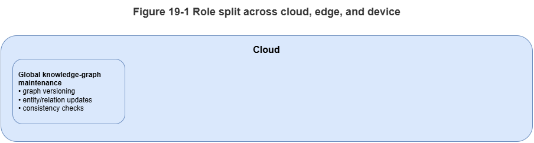
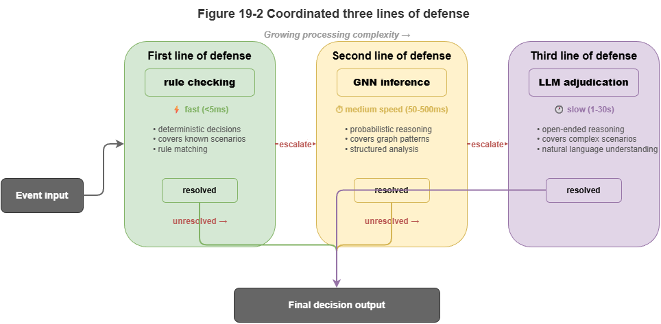
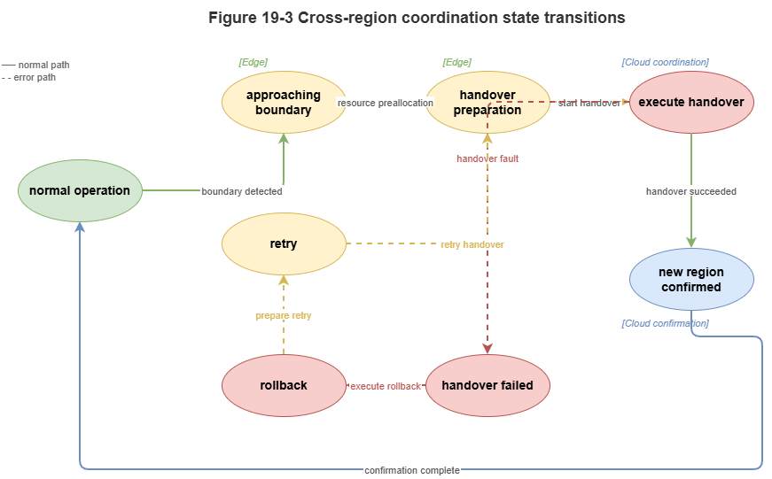

Chapter 18 argued that without addressing compute and latency, even advanced neuro-symbolic models cannot reach city-scale deployment. This chapter extends that view to **cloud–edge collaboration**: how to distribute KG, GNN, LLM, and rule engines across tiers for **global coordination** plus **edge real-time** trustworthy inference.

## 19.1 Roles of Edge vs. Cloud Inference

Physical placement sets latency and resource ceilings. For low-altitude traffic we use a clear **cloud–edge** split:

* **Cloud center:** Data-center scale, global view, tens to hundreds of milliseconds from vehicles.
  - **Role:** Full-city **SkyKG**; large LLMs; pre-flight strategic approval and macro weather; offline training, knowledge distillation, incident reporting. **“Slow” System 2** brain.
* **Edge node / MEC:** Near aircraft at 5G MEC or regional hubs—limited compute but often under 10 ms RTT.
  - **Role:** **Local TKG**; lightweight GNNs and hard-coded symbolic solvers; millisecond situational updates, conflict detection, emergency avoidance. **“Fast” System 1** reflex.

## 19.2 Orchestrating Rules, GNNs, and LLMs Across Tiers

Neuro-symbolic strength is complementary engines physically pipelined:

1. **Edge first line—hard rules:** High-rate telemetry hits a light symbolic engine (e.g., Datalog) for **hard checks** (no-fly intrusion, altitude limits). Violations block immediately without heavy AI.
2. **Edge second line—GNN:** Valid updates write to the local TKG; GNN message passing predicts 3–5 s conflicts with **conformal** uncertainty bands and avoidance hints.
3. **Cloud third line—LLM semantics:** When GNN marks **high risk but locally unsolvable** (large-scale congestion, severe weather) or **regulatory corner cases**, edge ships a context slice up; **GraphRAG + LLM** perform deep compliance and global replanning with human ATC review.

## 19.3 Streaming Ingest and Event-Driven Scheduling

Urban low-altitude systems are always-on data firehoses. **Polling** wastes compute and adds delay; use **event-driven architecture (EDA)**:

* **Streaming bus:** Kafka, Flink, etc., ingest ADS-B, 5G reports, and fused tracks.
* **Filtered triggers:** React only to **meaningful state changes**—steady on-route flight may skip graph recomputation; **yaw beyond threshold**, **new entrant**, or **weather alert** emits an **update event** activating GNN/rule pipelines.
* **Incremental KG updates:** Each event touches only affected subgraphs—no full-graph rebuilds.

## 19.4 Knowledge Sync, Model Sync, and Consistency

Distributed systems face CAP trade-offs. UAM favors **availability** and **low latency** over strong global consistency; we adopt **eventual consistency** and **fan-out sync**:

* **Knowledge push:** Slow static updates to **global SkyKG** (temporary no-fly zones, regulatory deltas) incrementally reach affected edges to refresh local rule layers.
* **State pull-up:** Edges downsample or abstract high-rate trajectories and periodically refresh the cloud macro picture.
* **Model OTA:** Improved GNN weights trained in cloud deploy to edges via **over-the-air** updates.

## 19.5 Real-Time Alerting and Closed-Loop Response

Inference aims at intervention. After edge conflict inference:

1. **Alert degradation:** Combine GNN output with Chapter 15 conformal bands—tight, reliable intervals may authorize automatic avoidance; **OOD**-wide intervals fall back to **hard safety** (e.g., hover-in-place).
2. **Control downlink:** Decisions send trajectory fixes to autopilots over the air–ground link.
3. **Audit:** Local graph snapshots, GNN output distributions, and fired rule IDs log asynchronously to cloud—closing the loop.

## 19.6 From Single-Node Feasibility to Multi-Node Scale

Real **SkyGrid**-style cities have hundreds or thousands of edge cells; vehicles **hand off** between them.

* **Handoff / roaming:** As a UAV moves from edge A to B, **state vectors and trust tokens** transfer smoothly so GNN history is not cold-started at the boundary.
* **Boundary coordination:** Worst conflicts often sit on **jurisdictional seams** where each edge sees only local traffic. Neighbors need **peer links** or **overlapping buffer zones** so boundary aircraft appear in **both** local TKGs for message passing.

Cloud–edge restructuring makes neuro-symbolic algorithms fit physical constraints. Chapter 20 drills into **spatiotemporal graph partitioning** and **high-concurrency engines** for million-scale operations.

## Chapter Summary

This chapter covered **distributed reasoning under cloud–edge collaboration**: cloud vs. edge roles (slow vs. fast thinking); layered defenses—rules, GNN, LLM; streaming buses and **event-driven** scheduling; eventual consistency for knowledge, models, and state; real-time alert–control–audit loops; and **handoff** plus **boundary** coordination for multi-node continuity.

## Key Concepts

- **Cloud–edge collaboration:** Tiering global slow inference vs. local fast inference by location and latency.
- **Event-driven scheduling:** Activating pipelines only on meaningful state changes.
- **Eventual consistency:** Favoring availability and low latency in distributed state.
- **Real-time response loop:** Detect → confidence check → act → log.
- **Handoff:** Preserving state and trust when crossing edge jurisdictions.

## Exercises

1. Why should rules, GNN, and LLM not all run on the same tier by default?
2. What is the main advantage of event-driven architecture over periodic polling for low-altitude traffic?
3. Without boundary coordination, what class of risk is most likely?

## Case Study

**Sudden weather at a regional edge:** local TKG + GNN deliver second-scale warnings; if local deconfliction fails, context escalates to cloud for global replan and regulator-facing explanation chains.

## Figure Suggestions

- Figure 19-1: Cloud, edge, and device role split.

- Figure 19-2: Three-line defense—rules, GNN, LLM.

- Figure 19-3: Handoff and cross-boundary state migration.

## Formula Index

- Architecture and workflow focus; no unified derivations.
- Index: cloud slow inference, edge fast inference, event-driven scheduling, eventual consistency, handoff.

## References

1. Shi, W., Cao, J., Zhang, Q., Li, Y., & Xu, L. (2016). Edge Computing: Vision and Challenges. *IEEE Internet of Things Journal*, 3(5), 637–646.
2. Satyanarayanan, M. (2017). The Emergence of Edge Computing. *Computer*, 50(1), 30–39.
3. Mao, Y., You, C., Zhang, J., Huang, K., & Letaief, K. B. (2017). A Survey on Mobile Edge Computing: The Communication Perspective. *IEEE Communications Surveys & Tutorials*, 19(4), 2322–2358.
4. Dean, J., & Ghemawat, S. (2008). MapReduce: Simplified Data Processing on Large Clusters. *Communications of the ACM*, 51(1), 107–113.
5. Kreps, J., Narkhede, N., & Rao, J. (2011). Kafka: A Distributed Messaging System for Log Processing. *Proceedings of the NetDB Workshop*.
6. Vogels, W. (2009). Eventually Consistent. *Communications of the ACM*, 52(1), 40–44.
