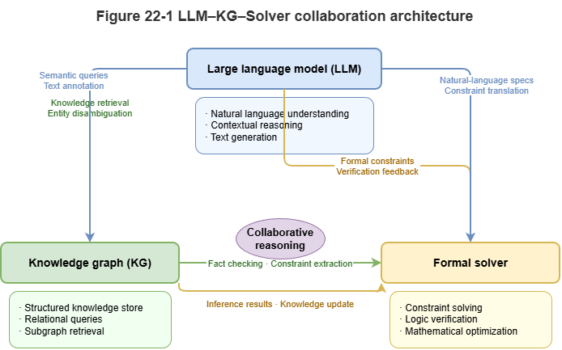
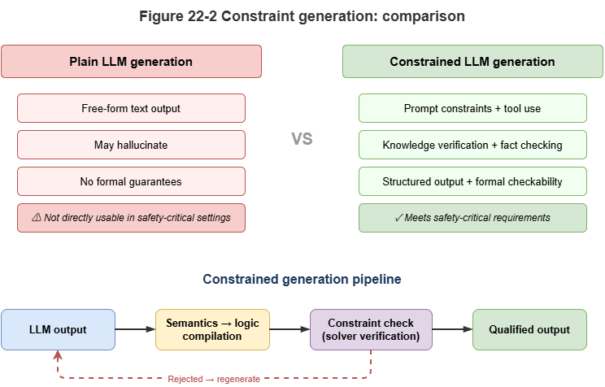
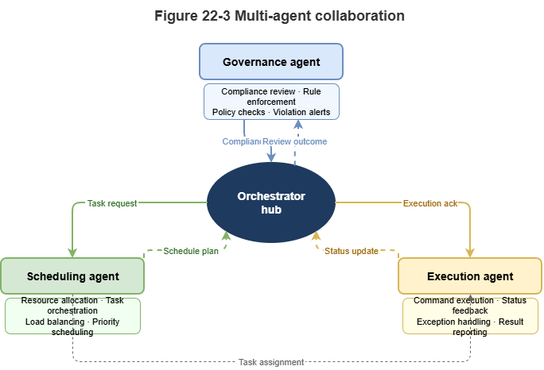

In the preceding parts of this book, we established a neuro-symbolic governance foundation centered on knowledge graphs, graph neural networks, and rule-based solving. In the era of large language models, a new question arises: what role should an LLM play in a neuro-symbolic system? This chapter addresses that question, focusing on how language models, knowledge graphs, external tools, and multi-agent collaboration jointly shape the next generation of neuro-symbolic systems.

## 22.1 The LLM as System 1: Strengths, Hallucinations, and Structural Limitations

Large language models exhibit remarkable zero-shot generalization, intent understanding, and commonsense reasoning. From the perspective of dual-process theory in cognitive science, an LLM can be viewed as the most powerful “System 1 (intuitive and associative processing)” to date.

* **Strengths:** LLMs greatly lower the barrier to human–machine interaction. In low-altitude traffic systems, an air traffic controller can ask in natural language why a certain UAV is restricted in a given area, without writing complex SPARQL. LLMs also handle unstructured text well and can quickly extract key entities from newly issued aviation notices (NOTAMs).
* **Hallucination:** Under the hood, an LLM is a probabilistic autoregressive token generator (next-token prediction). When facing knowledge gaps, this mechanism tends to produce fluent but false statements. In safety-critical UAM scenarios, such hallucinations can be fatal.
* **Structural limitations:** LLMs lack intrinsic, rigorous logical deduction and spatial–topological computation. For example, asking an LLM to compute collision probability for two UAVs in a complex wind field, or to decide whether two 3D airspace cells intersect, will often yield wrong numerical results even when the explanation sounds coherent.

Therefore, an LLM cannot alone serve as the “brain” of a traffic governance system; it must be deeply coupled with a symbolic rule stack acting as “System 2.”

## 22.2 Synergy Between Language Models and Symbolic Rules

Combining LLMs with symbolic rules aims to “wrap the rigidity of formal logic in the flexibility of natural language.” Current synergies fall roughly into three levels:

1.  **Prompting with rules:** The shallowest integration. Simple business rules are injected into the system prompt in natural language—for example: “You are an ATC assistant; strictly follow: if UAV battery is below 20%, it must land nearby…” This is cheap to implement, but the model may still violate constraints with nonzero probability.
2.  **Constrained decoding:** During token generation, symbolic rules act as hard constraints (e.g., regex or grammar trees constraining JSON), so outputs are not only semantically coherent but syntactically and entity-wise compatible with downstream systems.
3.  **Semantic parsing (“compile semantics to logic”):** The deepest integration. The LLM does not emit the final decision directly; it acts as a translator, turning natural-language questions into strict formal query languages (SQL, SPARQL, Datalog). The generated logic is executed by a deterministic symbolic engine, cutting hallucination risk in the reasoning step.

## 22.3 GraphRAG and Knowledge-Augmented Reasoning

Retrieval-augmented generation (RAG) is a mainstream mitigation for LLM hallucination. In rule-dense domains with rich entity relations—such as traffic—classical dense-vector RAG often loses spatial topology and logical dependencies.

**GraphRAG (graph retrieval-augmented generation)** brings the SkyKG built in Chapter 6 into the LLM reasoning chain:
* **Structured context extraction:** When a potential conflict arises, the system first locates relevant UAVs, waypoints, and weather nodes in SkyKG and extracts a connected **subgraph snapshot** via multi-hop queries.
* **Subgraph serialization:** Triples and associated rules (e.g., CCAR no-fly clauses) are turned into structured text.
* **Knowledge-anchored generation:** The LLM reasons and summarizes within this tight “knowledge boundary.” Because evidence comes from a certified graph substrate, answers gain high **faithfulness** and traceability.

## 22.4 LLM Invocation of External Solvers and Toolchains

To compensate for weaknesses in arithmetic, physics simulation, and temporal reasoning, LLMs need **tool use** (function calling)—a new modular collaboration pattern in neuro-symbolic systems.

In a low-altitude governance platform, specialized models can be wrapped as tools:
* Call `Collision_Predict_GNN(UAV_A, UAV_B)` to invoke a GNN for millisecond-scale conflict lookahead.
* Call `Check_Airspace_Intersection(Route, Zone)` to invoke a geometric solver for corridor–no-fly intersection.
* Call `Get_Conformal_Interval(Model_ID)` to obtain conformal prediction intervals.

In this architecture, the LLM becomes a **planner and router**: it parses complex intents, decomposes steps, calls external deterministic symbolic/physical solvers, and finally turns cold numbers into human-readable safety assessments.

## 22.5 Neuro-Symbolic Agents: Perceive–Retrieve–Reason–Act

When an LLM combines tool calling, external memory (SkyKG), and planning, the system evolves from a passive Q&A engine into an active **neuro-symbolic agent**. A typical agent loop (e.g., ReAct) closes the full cycle:

1.  **Perception:** The agent ingests high-rate telemetry and environment alerts via streaming interfaces.
2.  **Retrieval:** On anomalies, it queries historical event graphs and rule bases (GraphRAG).
3.  **Reasoning:** The LLM performs causal chaining; for hard computation it calls external solvers and sandboxes candidate interventions and outcomes.
4.  **Action:** After actions satisfy symbolic safety floors, the agent emits structured control commands (e.g., trajectory corrections) to the physical world and writes audit logs.

Such agents unify “flexibility from experiential intuition” with “safety from physical rules.”

## 22.6 Agent Collaboration for Complex Governance Systems

A monolithic agent struggles with city-scale low-altitude networks (thousands of concurrent UAVs). **Multi-agent systems (MAS)** are needed for collaborative governance.

Under a SkyGrid-style architecture, neuro-symbolic agents can play distinct roles:
* **Regulator agent:** Embeds the strictest CCAR logic and symbolic rules, holds veto power, and guards baseline safety.
* **Dispatcher agent:** Optimizes macro throughput via graph learning and reinforcement learning.
* **UAV agent:** Runs at the edge, focusing on local collision avoidance and emergency response.

During large-scale congestion or weather crises, agents interact via shared graph updates or natural-language negotiation. The dispatcher proposes evacuation plans; the regulator checks each plan for compliance (symbolic deduction); the best strategy is selected. This **rule-constrained multi-agent negotiation** is a mature form of neuro-symbolic AI for city-scale complex systems.

## 22.7 Supplement: Chain-of-Thought, Tool-Learning Frameworks, and Limits of LLM Reasoning

Earlier sections discussed how LLMs collaborate in neuro-symbolic stacks. This section adds three closely related topics—chain-of-thought reasoning, tool-learning frameworks, and theoretical limits of LLM reasoning—to clarify capability contours and fundamental constraints.

### 22.7.1 Chain-of-Thought (CoT) and Reasoning Enhancement

**Chain-of-thought prompting** (Wei et al., 2022) shows that asking an LLM to “think step by step,” emitting intermediate reasoning before the final answer, improves performance on arithmetic, commonsense, and symbolic manipulation. CoT aligns with the book’s recurring notion of **reasoning chains**: decomposing problems into verifiable substeps with traceable inference.

Building on CoT, researchers proposed structured variants. **Tree-of-Thought (ToT)** expands linear chains into tree search: multiple branches at each step, with heuristic scoring or pruning—strong on games and combinatorial planning. **Graph-of-Thought (GoT)** allows arbitrary directed dependencies among reasoning nodes, modeling parallel multi-step fusion.

Yet CoT variants still rely on autoregressive generation; step correctness has **no formal guarantee**. A “reasoning chain” can be fluent but logically invalid—unlike proof theory in symbolic logic. CoT is best viewed as **heuristic structured guidance**, not strict deduction: it improves behavior without changing the probabilistic nature of generation.

### 22.7.2 Tool Learning and Agent Frameworks

To address precise computation and external knowledge, **tool learning** frameworks emerged. **ReAct** (Yao et al., 2023) interleaves reasoning and acting: each step produces a thought, then an action (search, calculator, code), then an observation updating state—aligned with the perceive–retrieve–reason–act loop in §22.5.

**Toolformer** (Schick et al., 2023) trains models via self-supervision to decide when and how to insert API calls into text. **LangChain** and similar stacks standardize orchestration across interpreters, vector DBs, and KG APIs, lowering engineering cost for tool-augmented agents.

From a neuro-symbolic view, tool learning reframes the LLM from an **end-to-end solver** to a **dispatch hub**, returning exact computation, logic checks, and retrieval to deterministic modules—the modular architecture advocated throughout this book.

### 22.7.3 Theoretical Limits of LLM Reasoning

Despite CoT and tools, theory shows **intrinsic computational limits** for Transformer-based LMs.

Merrill and Sabharwal (2023) and related work place fixed-depth Transformers in **TC⁰**—functions computable by constant-depth, polynomial-size threshold circuits. TC⁰ includes basic arithmetic but **excludes** problems needing super-logarithmic depth, such as graph connectivity or Boolean SAT. Thus, regardless of scale, a fixed-layer Transformer cannot reliably solve tasks requiring genuine algorithmic reasoning—e.g., long carry propagation in arithmetic or arbitrary-length path reachability.

Intuitively, much of what looks like “reasoning” is **pattern matching and statistical association**—surface forms of reasoning from corpora, not formal proof. Performance often collapses under distribution shift or larger problem sizes. This supports the book’s thesis: **in safety-critical domains demanding strict correctness, symbolic components remain indispensable.**

### 22.7.4 Summary and Outlook

Chain-of-thought and tool learning are two practical paths to stronger LLM reasoning and action: structured prompting for layered thinking, and external tools for capability gaps. Theoretical bounds show these do not remove Transformers’ fundamental computational ceiling.

In dual-process terms, the LLM remains the strongest **System 1**—intuition, semantics, flexible dialogue. **System 2**—strict deduction, formal verification, provable correctness—still requires symbolic engines. Future neuro-symbolic systems should deepen LLM reasoning (e.g., CoT) while wiring tools to symbolic solvers, building hybrid intelligence that is both flexible and reliable—the core vision of this book.

## Chapter Summary

This chapter repositioned LLMs within neuro-symbolic AI. First, as a linguistic System 1, LLMs excel at intent, semantics, and interaction but suffer hallucination and structural reasoning gaps. Second, synergy with rules spans prompting, constrained decoding, and semantic-to-logic compilation. Third, GraphRAG anchors generation in explicit KG evidence. Fourth, tool calling turns the LLM from a direct solver into a planner/router, delegating computation to external solvers. Fifth, neuro-symbolic agents close perceive–retrieve–reason–act loops. Finally, multi-agent collaboration illustrates role separation, rule constraints, and negotiation at city scale.

## Key Concepts

- LLM as System 1: Treating the LM as the carrier of strong semantic association and interaction.
- Semantic-to-logic compilation: Mapping natural language to SPARQL, Datalog, etc.
- GraphRAG: Supplying evidence via KG subgraphs rather than generic document chunks.
- Tool calling: Delegating computation and verification to external modules.
- Neuro-symbolic agent: An agent that runs perceive–retrieve–reason–act within rule boundaries.

## Discussion Questions

1. Why is an LLM better cast as a “planner” than as the “final solver” in a neuro-symbolic stack?
2. What is GraphRAG’s most critical role in reducing LLM hallucination?
3. In multi-agent settings, why should a regulator agent often retain veto power?

## Case Study

Use a “natural-language low-altitude compliance query” case: the user asks in natural language; the LLM translates to graph queries and rule invocations; GraphRAG and external solvers return structured conclusions and explanations—showing the LLM’s optimal placement in the stack.

## Figure Suggestions

- Fig. 22-1: Synergy among LLM, knowledge graph, and external solvers.

- Fig. 22-2: Chat-style generation vs. tool-constrained generation.

- Fig. 22-3: Regulator, dispatcher, and executor agents in multi-agent negotiation.

## Formula Index

- This chapter focuses on system collaboration; there is no core mathematical derivation.
- Suggested index topics: prompt constraints, semantic-to-logic compilation, GraphRAG, tool calling, agent loop.

## References

1. Brown, T., et al. (2020). Language Models are Few-Shot Learners. *Advances in Neural Information Processing Systems* (NeurIPS).
2. Wei, J., et al. (2022). Chain-of-Thought Prompting Elicits Reasoning in Large Language Models. *Advances in Neural Information Processing Systems* (NeurIPS).
3. Yao, S., Zhao, J., Yu, D., Du, N., Shafran, I., Narasimhan, K., & Cao, Y. (2023). ReAct: Synergizing Reasoning and Acting in Language Models. *International Conference on Learning Representations* (ICLR).
4. Schick, T., et al. (2023). Toolformer: Language Models Can Teach Themselves to Use Tools. *arXiv preprint arXiv:2302.04761*.
5. Lewis, P., et al. (2020). Retrieval-Augmented Generation for Knowledge-Intensive NLP Tasks. *Advances in Neural Information Processing Systems* (NeurIPS).
6. Touvron, H., et al. (2023). LLaMA: Open and Efficient Foundation Language Models. *arXiv preprint arXiv:2302.13971*.
7. Mialon, G., et al. (2023). Augmented Language Models: A Survey. *Transactions on Machine Learning Research* (TMLR).
8. Bubeck, S., et al. (2023). Sparks of Artificial General Intelligence: Early Experiments with GPT-4. *arXiv preprint arXiv:2303.12712*.
