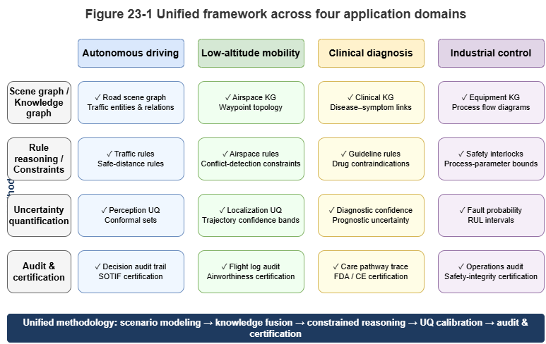
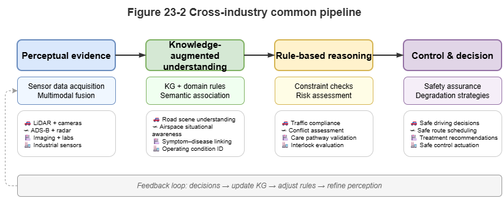
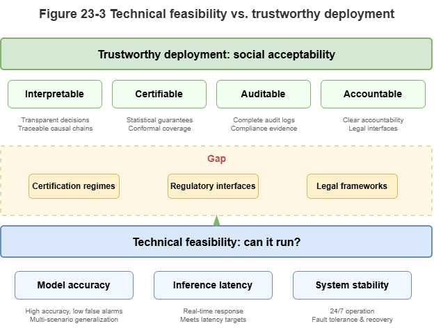

In earlier chapters we used urban low-altitude traffic (UAM) as the main thread to build and validate a neuro-symbolic reasoning stack. The hybrid paradigm of “perceive–know–reason–decide,” and its trustworthy certification mechanisms, are not unique to low-altitude operations. Wherever error tolerance is vanishingly small, physical laws bite hard, and expert knowledge dominates, purely data-driven models hit a deployment wall.

This chapter broadens the lens to **safety-critical** domains—intelligent transportation, autonomous driving, medical diagnosis, industrial control—and contrasts “works in the lab” with “safe to deploy” in the physical world.

## 23.1 Intelligent Transportation and Scene-Graph Understanding for Autonomous Driving

Autonomous vehicles are a canonical safety-critical system. End-to-end deep models (vision or multimodal) can score well on closed benchmarks yet remain brittle on **long-tail** and **corner-case** inputs.

Neuro-symbolic AI introduces the **scene graph**:
* **Perceptual abstraction:** Neural nets do not emit controls directly; they extract entities (vehicles, pedestrians, lane markings, traffic lights) and spatial relations, forming a dynamic scene graph.
* **Rule injection:** Traffic law is encoded as logical hard constraints on the graph—for example: “If this lane’s signal is red and a pedestrian entity is on the crosswalk ahead, the vehicle’s velocity vector must be constrained to zero.”
* **Causal reasoning:** At complex intersections, decisions rely not only on trajectory statistics but on symbolic causal reasoning over the scene graph—reducing absurd behaviors (e.g., accelerating toward a tunnel painted on a wall) and enabling structured accountability after incidents.

## 23.2 Urban Low-Altitude Traffic: Risk Assessment and Dynamic Coordination

As the book’s core scenario, UAM is even harder than ground autonomy: three degrees of freedom without fixed rails, plus fast-changing micro-weather.

Neuro-symbolic UAM systems operate at two levels:
1. **Static, macro risk assessment:** For large volumes of route approvals, SkyKG plus GraphRAG and LLMs process policy notices (NOTAMs), no-fly designations, and vehicle parameters into legally grounded safety reports, improving airspace management throughput.
2. **Dynamic, micro collision avoidance:** In dense airspace grids, GNNs message-pass on temporal knowledge graphs (TKGs) for millisecond conflict lookahead. **Conformal prediction** turns black-box collision scores into statistically covered **safety envelopes**; symbolic engines assign right-of-way and trigger deterministic multi-UAV interventions.

## 23.3 Explainable Reasoning in Medical Diagnosis

Healthcare is safety-critical: misdiagnosis can be fatal. Knowledge is dense and highly structured (e.g., UMLS, SNOMED CT).

Neuro-symbolic clinical decision support bridges deep learning and clinical ethics:
* **Multimodal perception and knowledge alignment:** Deep models read imaging (X-ray, MRI) and unstructured notes, mapping findings to standard concepts in medical ontologies.
* **Guideline-driven deduction:** Clinical practice guidelines (CPGs) compile to symbolic rules; the engine performs differential diagnosis over the graph and patient state.
* **Explainable reports:** Instead of “malignancy probability: 95%,” the system emits a ward-round-style chain: “Spiculated margin on imaging (perceptual evidence), long smoking history and family history (attribute evidence), high-risk path on the medical KG (logical evidence)—recommend biopsy.” **Knowing why** is key to clinician trust.

## 23.4 Industrial Control and Fault Diagnosis in Complex Plants

Modern plants—smart grids, nuclear facilities, highly automated factories—are massive cyber-physical systems (CPS) of sensors, actuators, and physical networks.

Traditional alarms can **storm** the operator when one fault fans out. Neuro-symbolic AI fuses mechanism and data:
* **Topological knowledge graphs:** P&ID diagrams, electrical schematics, and equipment hierarchies become industrial KGs.
* **Temporal-graph anomaly tracing:** Deep models (TCN, graph nets) monitor SCADA time series for subtle anomalies. On alert, symbolic engines trace backward along topology (current flow, pressure paths).
* **Physics constraints:** Conservation laws enter as hard terms in losses (PINNs). Diagnoses must match both statistics and first-principles derivations, improving engineering feasibility.

## 23.5 From “Usable” to “Trustable”

Moving from the lab to safety-critical operations is a leap from **usable** to **trustable**.

* **Usable:** High accuracy/F1/BLEU on a fixed test set; demos handle common cases; outputs are essentially probabilistic guesses from the training distribution. Connectionist models have largely solved “usable.”
* **Trustable:** Clear **operational design domain (ODD)**; on unknown or extreme long-tail inputs, calibrated uncertainty and **graceful degradation**; tamper-resistant audit logs and causal explanations for critical decisions; core logic certifiable to aviation or automotive standards (e.g., DO-178C, ISO 26262).

The historical mission of neuro-symbolic AI is to **bridge this gap**—not to replace neural perception with rules, but to **fence deep learning with logical guardrails** and **calibrate overconfident black boxes with statistical coverage guarantees**. When AI is no longer an opaque “alchemy kettle” but a **white-box** machine—sharp in perception, strict in logic, and aware of its limits—society can safely delegate governance of low-altitude airspace, health, and heavy industry.

## Chapter Summary

This chapter showed neuro-symbolic value beyond UAM. Autonomous driving uses scene graphs and rules to turn perception into accountable world models. UAM combines static assessment and dynamic avoidance. Medicine aligns multimodal signals with KGs and CPG rules for explainable advice. Industry uses topology, temporal anomaly detection, and physics constraints. The unifying message: safety-critical domains need systems **trustable under real responsibility**, not only models that score well on benchmarks.

## Key Concepts

- Safety-critical setting: Environments where errors cause major physical, human, or institutional harm.
- Scene-graph understanding: Abstracting perceived objects and relations into a reasoning-friendly graph.
- Guideline-driven reasoning: Decisions grounded in formal standards and expert knowledge (e.g., medicine).
- Mechanism-constrained diagnosis: Outputs consistent with both statistical patterns and physical causality.
- From usable to trustable: Crossing from experimental viability to institutional and liability acceptance.

## Discussion Questions

1. Why do safety-critical industries need neuro-symbolic methods more than typical web applications?
2. For autonomous driving, medicine, and industrial control, what is each domain’s **primary knowledge carrier**?
3. To go from usable to trustable, what matters more than another point of accuracy?

## Case Study

A triple case—intersection negotiation (driving), clinical CDSS (medicine), industrial fault tracing—illustrates scene graphs, guideline graphs, and industrial topology graphs as reusable patterns.

## Figure Suggestions

- Fig. 23-1: Unified framework across driving, UAM, medicine, and industrial control.

- Fig. 23-2: Shared pipeline from perceptual evidence through rules to control.

- Fig. 23-3: Contrasting “usable” vs. “trustable” capabilities.

## Formula Index

- Cross-industry comparison; no core derivations.
- Suggested index topics: scene graphs, knowledge graphs, mechanism constraints, audit chains, degradation, certification interfaces.

## References

1. RTCA (2011). *DO-178C: Software Considerations in Airborne Systems and Equipment Certification*.
2. ISO (2022). *ISO 21448: Road Vehicles — Safety of the Intended Functionality (SOTIF)*.
3. Esteva, A., et al. (2017). Dermatologist-level Classification of Skin Cancer with Deep Neural Networks. *Nature*, 542(7639), 115–118.
4. Bojarski, M., et al. (2016). End to End Learning for Self-Driving Cars. *arXiv preprint arXiv:1604.07316*.
5. Topol, E. J. (2019). High-performance Medicine: The Convergence of Human and Artificial Intelligence. *Nature Medicine*, 25(1), 44–56.
6. Silver, D., et al. (2016). Mastering the Game of Go with Deep Neural Networks and Tree Search. *Nature*, 529(7587), 484–489.
